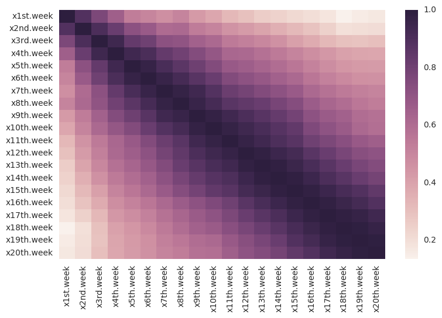
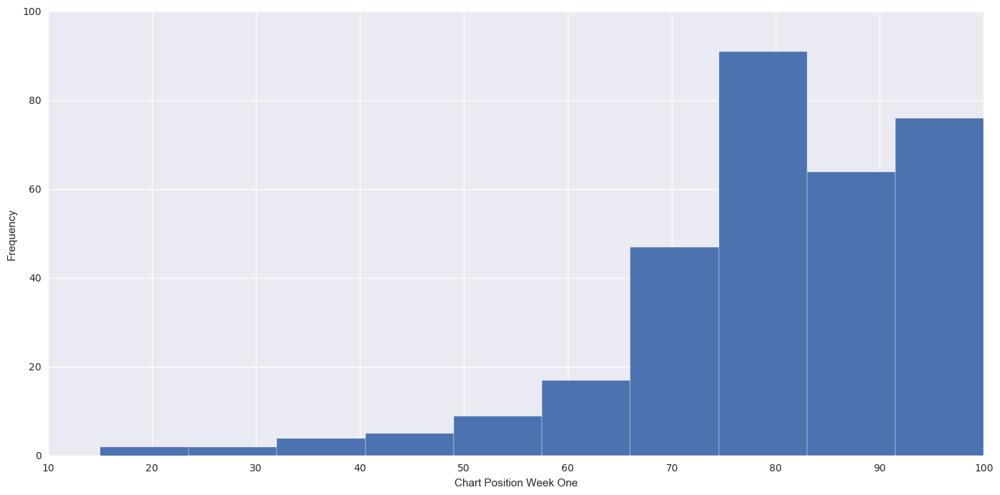
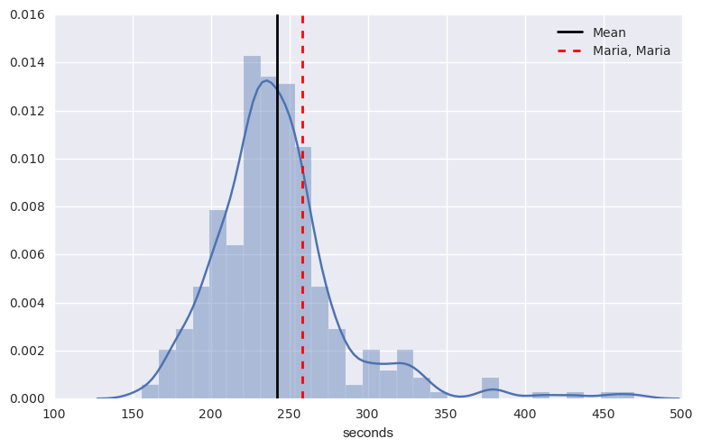
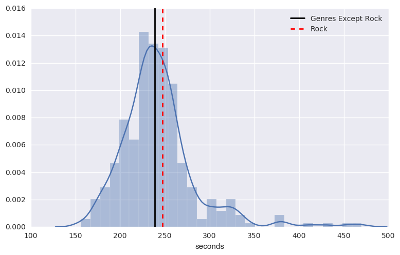

Does the length of a song hold the secret to success on the Billboard charts? The results are inconclusive, but there is at least one statistically meaningful difference when comparing hit rock songs from 2000 to hits in other genres.

Let's take a deep dive.

Song length did not correlate to Billboard chart success in 2000. In fact, the only strong correlations were between chart positions in adjoining weeks, as demonstrated by the heat map below.

In 2000, a song was more likely to enter the charts at No. 80 than any other position. This makes sense as one would expect a song to enter towards the bottom and climb to the top.

There were of course exceptions to this rule.

Santana's 'Maria, Maria' entered the charts at No. 15, making it an outlier in terms of its initial chart position. Surprising perhaps, but consider at this point, Santana was a Woodstock legend with roughly 30 years of recording experience.

Was there anything else different about 'Maria, Maria' when compared to other hit songs in 2000?

Indeed. 'Maria, Maria' was longer than the average hit; it was over 15 seconds longer to be precise. In fact, 'Maria, Maria' was longer than over 50 percent of all songs that charted in year 2000.

This begs the question of whether rock songs that charted in 2000 were different in terms of length when compared to other genres.

The mean of rock songs on the Billboard chart was 242.43 seconds. The mean of all other genres excluding rock was 238.52. A frequentist hypothesis test tells us that there is a statistically significant difference in these means.

Hit rock songs were simply longer on average than all other hit songs.

So did the length of a rock song contribute to its success in 2000? It's impossible to draw a causal conclusion, as this analysis is based on observational data. Moreover, The Billboard 100 chart did not include songs that did not chart, making a comparison impossible. Nonetheless, the possible predictive value of song length is worth greater exploration.
