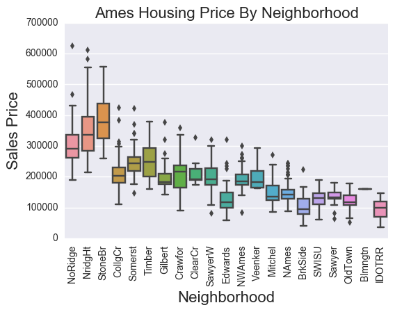
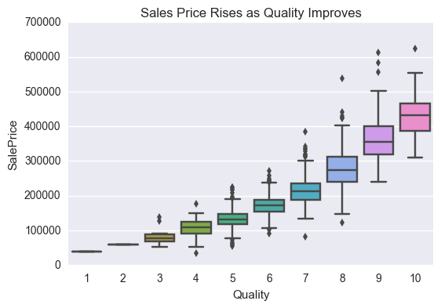
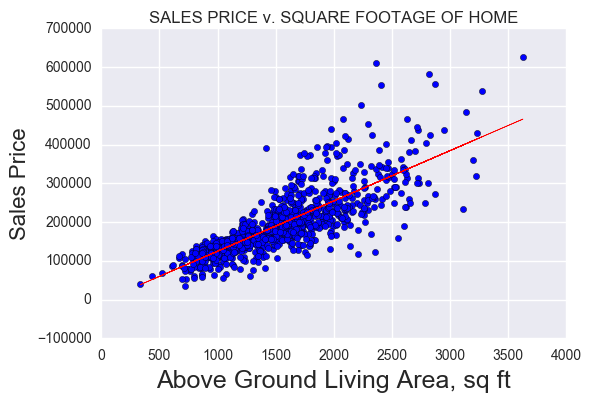

'Location, Location, Location.' It's a real estate platitude. Some consider location the greatest influence on home prices. But is it true?

In Ames, Iowa, location is one of many predictors of price, but it's not the most important predictor.

For sure, different neighborhoods command different prices. Just look at the box plot of Ames prices by neighborhood. Homes sell in some areas in excess of $500,000, while others cannot crack the $200,000 threshold. This is strong evidence that location matters above all else.

Nevertheless, there are strong, if not stronger influences on home prices in Ames, at least between 2006 - 2010.

The overall quality of a home has a strong linear relationship with home prices as demonstrated by the box plots below. As the quality of a home rises, so does it price.

The square footage of a home also has a strong upward influence on home prices.

In fact, the above ground square footage of a home is the greatest predictor when compared to all other variables.

If we run a regression analysis on the Ames data set, we see that the largest coefficients-- that is the five biggest influences on price-- are the above ground square footage;  a single pricey neighborhood;  the year built; the overall quality of a home; and another pricey neighborhood. Every other location is subordinate to these five variables.

So, yes, location does matter, but when predicting homes in Ames, the size, quality and age of a home matter too. In fact, one can predict with fair accuracy the the price of a home based on the above variables, though inclusion of every neighborhood increases the accuracy of that model by roughly 10 percent.

L
