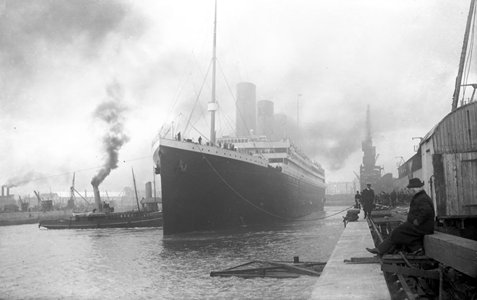
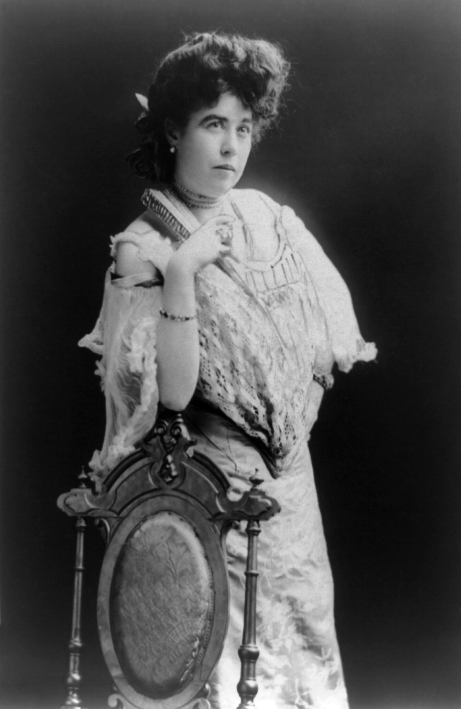
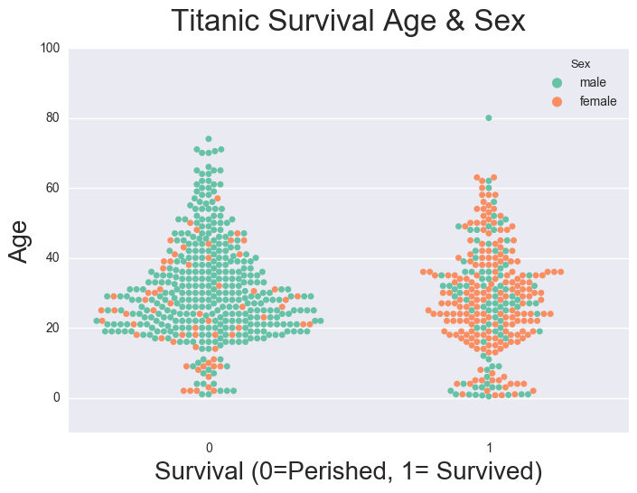
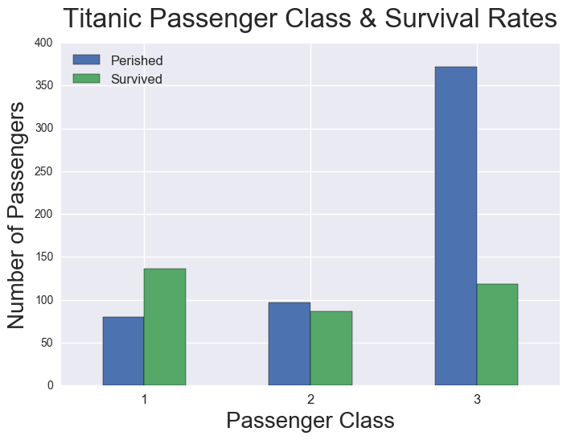
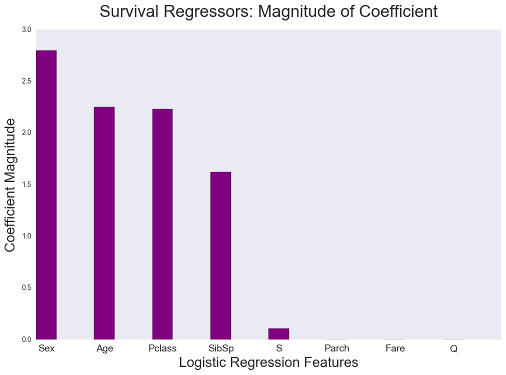

"It was sad when the great ship went down." -- Old Camp Song

Why did some people survive the Titanic, while others perished at sea?

Patterns in Titanic passenger information show that one could have predicted with decent accuracy who would live and die before the ship even set sail from Ireland for America. There is nothing supernatural about this assessment as survival can be predicted in part by simple demographics.

BACKGROUND

Constructed in Belfast, Northern Ireland between 1909 and 1912, the Titanic was at the time, the largest luxury ocean liner ever built. The ship also inspired great hubris. Many considered the Titanic unsinkable, so its owners outfitted it with inadequate lifeboat capacity.

The ship made three stops on its maiden voyage from Southampton, England to New York, NY. The first stop was in Cherbourg, France. The second was Cobh (Queenstown), Ireland. Passengers boarded at each port.

Though the ship could carry between 2,500 to 3,500 passengers, in addition to a complement of 900, there were fewer than 1,400 passengers on the Titanic's first voyage to NYC. The vast majority of passengers were third class, and most were men.

On the evening of April 14, 1912, the Titanic hit an iceberg off the coast of Canada and sank to the bottom of the sea. Close to 1,500 people died that evening.

PATTERNS IN TITANIC DEATHS

History has left us wealth of information about Titanic passengers, including names, titles, ages, genders, passenger class, ports of embarkation, and ticket/ cabin information. From this we can glean information about a passenger's social status and possible wealth.

Review of Titanic passenger information reveals that there were some patterns to deaths.

(Famed Titanic survivor Margaret Brown, aka The Unsinkable Molly Brown. Legend has it that Brown forced her lifeboat pilot to search the dangerous Titanic debris field for survivors. Why did Molly Brown live while so many others perished?)

The first pattern concerns sex and age. Though most of the passengers were men, most of the survivors were women. There were a greater number of children who survived than not, and the the median age those who perished was slightly lower.

Another pattern concerns passenger class. The Titanic had three classes of descending quality: First, Second and Third. More people in Third Class perished on the Titanic than in First and Second Class combined. This is not surprising as most were Third Class passengers.

What is surprising is the percentages of those in Third Class who perished when compared to other classes: Over 75 percent in Third Class died; over half of Second Class passengers died; and less than 37% of first class passengers died.

These patterns also reveal something chilling. Some people were seemingly doomed to perish in the North Atlantic the moment they stepped foot on the great ship. Others were destined to live.

If we perform a logistic regression analysis using passenger information, we can predict with 80 percent accuracy which passengers would survive and which would die.

The passenger variables contributing most to these predictions were sex, age and passenger class. Whether someone had a sibling and/or spouse on the Titanic also contributed to predicting survival.

This isn't to say that most of the passengers were destined to drown on April 1912. This is not a causal connection. It's just that these variables allow us to predict with high accuracy whether someone would survive, even though gender and age are circumstances of birth.

So what was it about the variables that caused some to survive? "Women and Children First" is a good guess.

The role of passenger class is uncertain at this stage. Passenger class may have had unwritten privileges, though we would need to perform historical research to determine this.  Perhaps the proximity of passenger cabins gave First Class passengers a better opportunity to abandon ship safely, but again, we need more research to determine this.

Sources:
National Museum of Northern Ireland, accessed 3/8/17, https://nmni.com/titanic/Design-Build/Why/Titanic-Introduction.aspx

Kaggle.com

Image Sources:

Wikipedia (Photo of the unsinkable Molly Brown)

National Museum of Northern Ireland (Image of Titanic): https://nmni.com/titanic/Design-Build/Why/Titanic-Introduction.aspx
