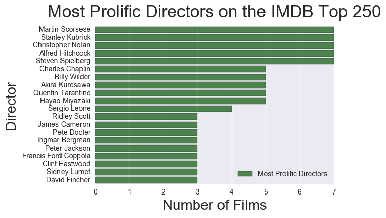
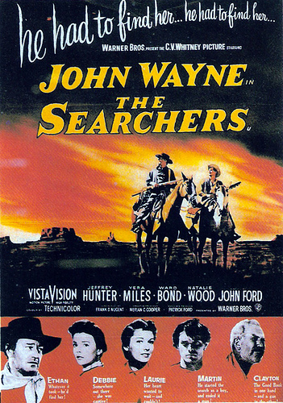
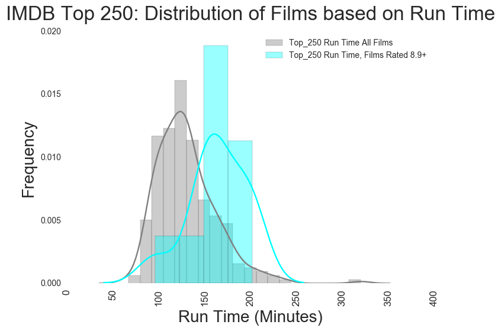
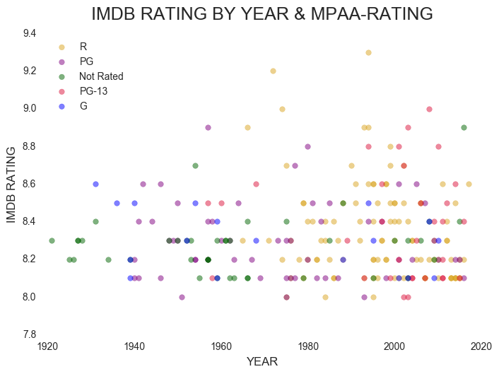
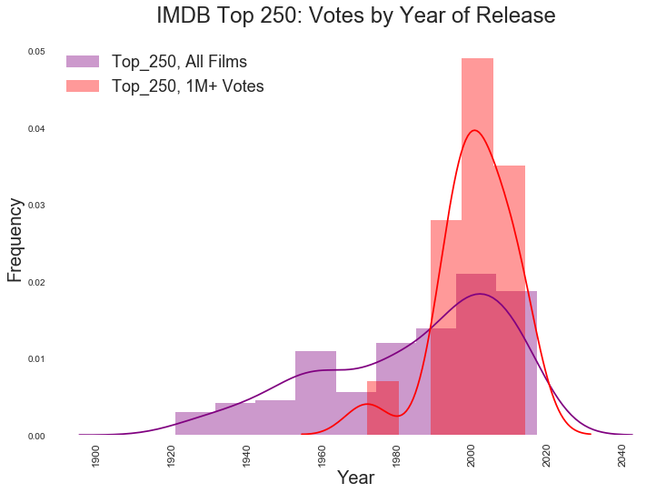
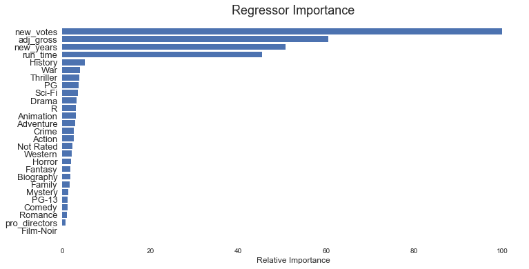

Can we predict the popularity of a movie? When it comes to the IMDB Top 250 list, patterns emerge, but predicting an actual rating is difficult, at least using classification techniques.

BACKGROUND

The popular movie site IMDB provides basic information about movies, including descriptions, studio information, revenues, genres, directors, actors, ratings and more.

IMDB published user ratings for each film. The ratings are ranked on a 0-10 scale, and the ratings can change over time as people continue to vote, and/or remove their votes.

IMDB also maintains a list of what it considers the Top 250 movies. IMDB places films on this list pursuant to a formula that produces a weighted average based on the number of votes and ratings for films.

PATTERNS

There are patterns among the films on the IMDB Top 250.

Directors

Some directors are better represented than others. As one would expect, the most represented directors are among the greatest, and include Martin Scorsese, Stanley Kubrick, and Alfred Hitchcock.

Oddly, John Ford has only one film on the Top 250: "The Grapes of Wrath". Among film historians, Ford is best known for "Stagecoach", "The Searchers" and his so-called cavalry trilogy.  What makes Ford's single entry so odd, is that Ford is perhaps the single most influential director.

In "Stagecoach", Ford gave birth to the classic Hollywood film narrative.  Ford also influenced many of the directors on the Top 250, including Scorsese and Spielberg, both of whom have seven films on Top 250. Akira Kurosawa named Ford as his greatest influence (five films on the Top 250), and Kurosawa in turn provided the cinematic inspiration for the Star Wars series. There are four Star Wars films on the Top 250.

Therefore, Ford's absence tells us a great deal about the Top 250. While "The Searchers" is perhaps one of the most influential films ever, it is not a favorite among IMDB visitors, who rate it 8.0. The movie has only 67,000 votes, and there are only 30 films on the Top 250 with fewer than 68,000 votes. Of those 30 films, the mean is 8.3; not a single one rates 8.0.

"The Searchers" had Scorsese's seal of approval, but not enough love form IMDB visitors.

Length

Highly rated films on the IMDB Top 250 tend to be longer, and the highest rated films (9.0+) are all crime dramas.

The highest IMBD rated films also tend to be 'R' and 'PG-13' rated.

Gross Revenues

Analyzing IMDB revenues is difficult because the Top 250 spans 95 years, making inflation a legitimate concern. Furthermore, some films drew revenues in francs, rupees, lira, and/or dollars. When we adjust for currency values and inflation remarkable patterns emerge in the data.

While "R" rated films account for 41 percent of all films on the Top 250, the adjusted mean gross revenue for "R" films is half that of "PG" rated films, and a third of "G" rated films.

The earning power of "PG" is best exemplified in the above graph in the period between 1975 through 1985. I call this the "Lucas-Spielberg Superhighway" as it this swathe of purple bubbles contains the first "Star Wars" trilogy, "Raiders of the Lost Ark" and "Jaws".

We also see the enduring earning power of "G" rated films in the above visual. "Gone with the Wind", and it is one of the highest earners on the list, notwithstanding its 1939 production.

In full disclosure, it was necessary to update the ratings for many of the films using IMDBs suggested ratings, TV ratings and overseas ratings.

Visitor votes

IMDB allows visitors to vote for films. These votes not only influence the rating, but also whether a film makes the Top 250.

Newer films are more likely to have over one million votes, and those films rated over 8.9 tend gross more than than the average Top 250 film.

MODELING

Notwithstanding the abundance of patterns in the Top 250 list, it's difficult to predict IMDB ratings for these films, at least using classification algorithms.

Regression

A regression model using gradient boosting produced a decent model with an MSE of .03 and an R squared of .54. Decent numbers.

As demonstrated by the plot below, the best features for a gradient boosting regressor are: 1. visitor votes ("new_votes"); adjusted gross income ("adj_gross"); and the year of release ('new_years').

The strength of these features are not surprising. Visitor votes are what determines the ratings, and the adjusted gross is stronger in the 1970s & 1980s. The length of a film  is at first surprising, but remember that length is longer for highly rated films.

Classification

A gradient boost classification model with K-Best feature selection can produce a model with 25 percent accuracy. A random forest model produce a model with 27 percent accuracy. Neither are  great. Decision trees and random forest models do not perform much better.

K-Best feature selection algorithms tell us that the best variables are length, visitor votes, gross revenue, two MPAA-ratings and select genres (Sci-Fi, Fantasy, Western).  IMDB on the other hand, places movies on the IMDB list using several factors. Genre is not one of them.
