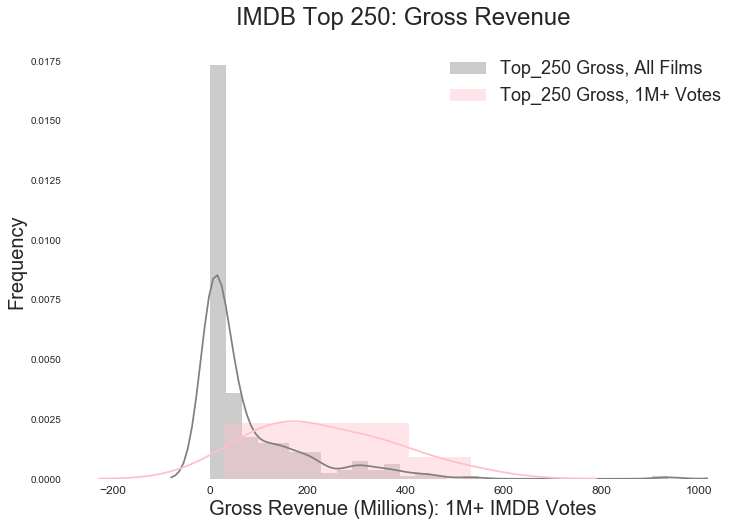

Can we predict the popularity of a movie? When it comes to the IMDB Top 250 list, patterns emerge, but predicting an actual rating is difficult, at least using classification techniques.

BACKGROUND

The popular movie site IMDB provides basic information about movies, including descriptions, studio information, revenues, genres, directors, actors, ratings and more.

IMDB also maintains a list of what it considers the Top 250 movies. IMDB places films on this list pursuant to a formula that produces a weighted average based on the number of votes and ratings for films.

PATTERNS

There are patterns among the films on the IMDB Top 250.

Some directors are better represented than others. As one would expect, the most represented directors are among the greatest, and include Martin Scorsese, Stanley Kubrick, and Alfred Hitchcock.

Highly rated films on the IMDB Top 250 tend to be longer, and the highest rated films (9.0+) are all crime dramas.

The highest IMBD rated films also tend to be 'R' and 'PG-13' rated. 'R' and PG-13 films are among the highest grossing films.

IMDB visitor behavior reveal more patterns. IMDB allows visitors to vote for films. Those on the Top 250 list with over 1 million IMDB votes are more likely to gross over $1 billion. That IMDB visitors vote more often for films that draw heavily at the box office.

MODELING

Notwithstanding the abundance of patterns in the Top 250 list, it's difficult to predict IMDB ratings for these films, at least using classification algorithms.

Gradient boosting can produce a model with 23% probability. Not great.
Decision trees and random forest models do not perform much better. Even using feature selection techniques, it's difficult to break the 23% probability threshold.

The good news is that a gradient boosting regressor can produce a model with a .03 mean squared error on a test set, making regression techniques a preferable means of predicting IMDB movie ratings.

There is probably a better approach to predicting movie ratings on the Top 250. The features in this analysis uncovered as most predictive are not the features used exclusively by IMDB for placing films on the Top 250 list in the first place.

K-Best feature selection algorithms tell us that the best variables are length, visitor votes, gross revenue, two MPAA-ratings and select genres (Sci-Fi, Fantasy, Western).  IMDB on the other hand, places movies on the IMDB list using several factors. Genre is not one of them.

Perhaps recreating a list that takes the factors IMDB uses to create the Top 250 will create a better predictive model.
