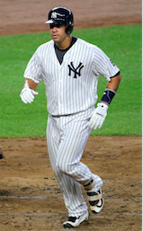

**Income Inequality 'Ain't' Bad for Baseball**

Income inequality is a major public policy issue. The belief is that income inequality hurts everything from government to personal health.

**INCOME INEQUALITY IN BASEBALL?**

Baseball is a microcosm for all things American. Values of business, immigration, race, fairness and family often reveal themselves on baseball's verdant fields of play. It's a pastime where spectators can witness repeated failure in the absence of fear, and catch fleeting glimpses of the improbable on calm breezy days.

But do the dangers of income inequality also reveal themselves in major league baseball?

**COMPETING THEORIES OF INCOME INEQUALITY IN BASEBALL**

There are differing opinions on the subject of income inequality in baseball.  

One theory is that income inequality has a negative influence on team performance. When examining baseball data from 1985-2010, a team of Australian and French researchers found a negative relationship between baseball wage dispersion and team performance.  

The other theory is that baseball inequality is having little impact on baseball team performance. This theory, based on the 2010 season, finds no relationship between baseball income inequality and team performance.

This author's research is based on statistics from 2000 through 2016, and it confirms the latter theory. Income inequality is having little impact on team wins.

**SALARIES**

*(Average Baseball Salaries Are Rising)*

Baseball salaries have been rising since 1985, as have the distribution of those salaries. In 1985, there was a small spread in the salaries paid by different teams. By 2016, some teams were paying over $200,000,000 per season (Yankees & Dodgers), while others were paying closer to $70,000,000 (Astros, Diamondbacks & Rays).

*(Team Baseball Salaries Are Diverging)*

Scholars agree that as salaries rose in baseball, so did the inequality of pay among players. What do we mean by inequality? Yankee center fielder Jacoby Ellsbury hit nine home runs in 141 games in 2016, and will earn $21 million in 2017. Sitting on the same bench as Ellsbury is Gary Sanchez, who will earn $558,000, even though he hit 20 home runs in 53 games the previous year.

Such examples of salary inequality are not the result of "unfairness" as much as they are the result of highly regimented salary structures in baseball; salary structures that are governed by league minimums, arbitration, and free agency.

*(Gary "The Krakken" Sanchez hit 20 home runs in his rookie year with the New York Yankees. He will earn half million dollars in 2017. Photo: Wikipedia)*

While Gary Sanchez appears underpaid, remember that Ellsbury has a World Series ring, and one season in which he batted .321, hit 32 home runs, and stole 39 bases. Gary Sanchez in contrast is a rookie who is subject to the league minimum salary structure.

**MEASURING INEQUALITY**

A popular measure for assessing inequality among populations is the Gini coefficient. A Gini coefficient of 1.0 means complete income inequality in a population; a Gini coefficient of 0.0 means complete equality.

We can apply the Gini coefficient to every baseball team from 1985-2016. It shows that team baseball salaries tend towards more inequality than less. Not only that, inequality is greater in the so-called Moneyball era than before the Moneyball era (The Moneyball era beginning with the Oakland A's use of data science analysis in the 2002).

*(Inequality is increasing in baseball)*

**MODELING INCOME INEQUALITY & BASEBALL WIN PERCENTAGES**

Team salary inequality is a poor measure of a team's performance. Teams with higher inequality win World Series (1995 Atlanta Braves); teams with lower inequality win World Series (1996 NY Yankees; 2014 SF Giants); Teams with middling salary distributions win World Series (2016 Cubs).

Furthermore, there is no apparent pattern to the salary distributions when it comes to division wins. Year after year, teams with relatively high and low Gini coefficients win their divisions. In 2016, the team with the lowest Gini won its division, as did the team with the highest Gini.

When we plot team Gini coefficients against Win Percentage, we again see no apparent pattern. Teams with high Gini coefficients win as much as teams with relatively low Gini coefficients.

*(Though there appears to be a slight negative relationship between Win Percentage and Gini, the relationship is weak and is likely the result of leverage created by a few distant points)*

A team's Gini coefficient does little to improve the predictive power of multivariate models utilizing traditional sabrmetric features.

For instance, a simple linear model predicting Win Percentage will perform well using features such as run differential, on-base percentage plus slugging (OPS), team salary, and team Gini.  

If we then remove salary and Gini as features, the model remains strong. In fact the R squared improves slightly when we remove the salary and Gini features. If we run a model predicting Win Percentage using team Gini only, the model has a low R squared, and little predictive value.  

In other words, team income inequality has no linear relationship with team wins, and has little value as a feature when attempting to predict a baseball team's Win Percentage.

This is not to say that income inequality is "good" for baseball. Income inequality simply is not "bad" for baseball. It is also a stretch to impute the findings of these models on the rest of society. Even the lowest paid major league player is rich in terms of income. Moreover, high major league performance will result in riches, adding greater incentives to perform than in other lines of work.

**SELECT SOURCES**

[CNN,](http://money.cnn.com/2013/09/25/news/economy/income-inequality/) "How income inequality hurts America", 9/25/13

[R. TODD JEWELL, MICHAEL A. McPHERSON, and DAVID J. MOLINA,](https://www.researchgate.net/profile/Michael_Mcpherson2/publication/5211498_Testing_the_Determinants_of_Income_Distribution_in_Major_League_Baseball/links/0c960521d6b7c56218000000.pdf)"Testing the Determinants of Income Distribution in Baseball," Economic Inquiry, 42 (3), July 2004, pp. 469-482.

[R. Todd Jewell and David J. Molina,](http://csyue.nccu.edu.tw/ch/The%20Effect%20of%20Salary%20Distribution%20on%20Production%20(MLB).pdf) "The Effect of Salary Distribution on Production: An Analysis of Major League Baseball", Economic Inquiry, Volume 42, Issue 3 July 2004, Pages 469–482

[Barry Krissoff,](https://sabr.org/latest/krissoff-society-and-baseball-face-rising-income-inequality) "Krissoff: Society and Baseball Face Rising Income Inequality, Baseball Research Journal, Spring 2013.

[Baseball Reference](https://sabr.org/latest/krissoff-society-and-baseball-face-rising-income-inequality) Yankee salary information.

[Baseball Reference](http://www.baseball-reference.com/teams/NYY/2016.shtml) Yankee statistics.
