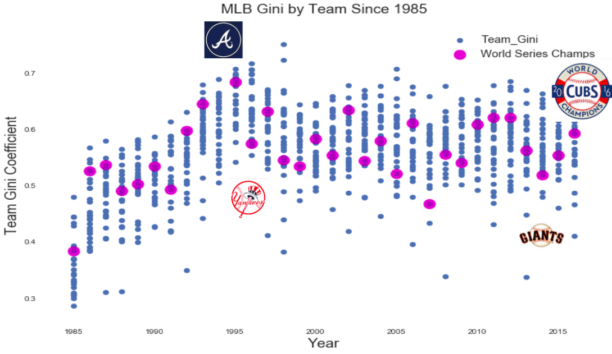
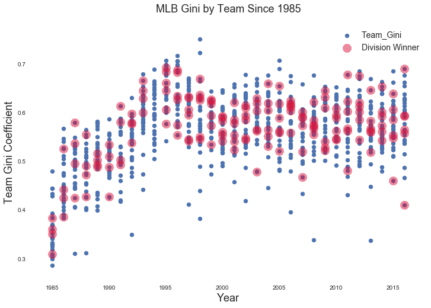
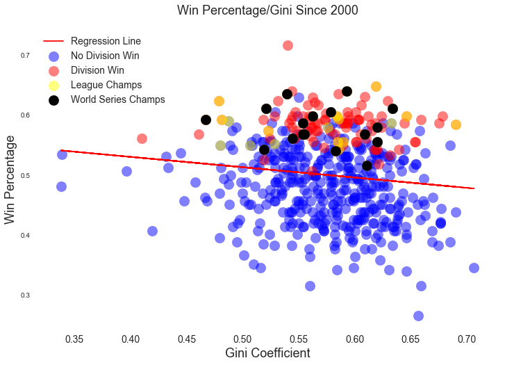

Income inequality is a major public policy issue, at least for people on the left. The belief is that income inequality hurts everything from government to personal health.

What about baseball?

Baseball is a microcosm for all things American. Values of business, immigration, race, fairness, family, music, alcohol and cuisine often reveal themselves on baseball's verdant fields of play. It's a pastime where spectators can witness repeated failure in the absence of fear, and catch fleeting glimpses of the improbable on calm breezy days.

But do the dangers of income inequality also reveal themselves in major league baseball?

COMPETING THEORIES OF INCOME INEQUALITY IN BASEBALL

There are differing opinions on the subject of income inequality in baseball.  

One theory is that income inequality has a negative influence on team performance. When examining baseball data from 1985-2010, a team of Australian and French researchers found a negative relationship between baseball wage dispersion and team performance.  A similar theory by a Texas researcher in 2001 utilizing data from 1985 - 2000 seasons.

The other theory (Krissoff 2013) is that baseball inequality is having little impact on baseball team performance. This theory, based on the 2010 season, finds no relationship between baseball income inequality and team performance.

So which is correct? Is income inequality hurting baseball?  

When assessing team inequality using a Gini coefficient, and using it as a feature in a linear regression model, the answer is no.

Income inequality is not negatively influencing baseball outcomes, at least with respect to the 2000 through 2016 seasons. In fact, adding measures of team salary inequality to classic sabrmetric measures of team performance provides no predictive improvement on those metrics. In fact, measures of salary and salary inequality make increase slightly the errors in a linear regression model.

SALARIES

Baseball salaries have been rising since 1985, as have the distribution of salaries.

(Mean baseball salaries are rising)

(Salaries are rising, are the differences in total team salaries. Some teams pay more than others).

Scholars agree that as salaries rose in baseball, so did inequality of pay among players. What do we mean by inequality? Yankee center fielder Jacoby Ellsbury hit nine home runs in 141 games and will earn $21 million in 2017. Sitting on the same bench as Ellsbury is Gary Sanchez, who will earn $558,000, even though he hit 20 home runs in 53 games the previous year.

Such examples of salary inequality are not the result of "unfairness" as much as they are the result of a highly regimented salary structure in baseball, governed by league minimums, arbitration, and free agency.

(Gary "The Krakken" Sanchez hit 20 home runs in his rookie year with the New York Yankees. Source: Wikipedia)

While Gary Sanchez appears underpaid, remember that Ellsbury has a World Series ring, and one season in which he batted .321, hit 32 home runs, and stole 39 bases. Gary Sanchez in contrast is a rookie who is subject to the league minimum salary structure.

A popular measure for assessing inequality among populations is the Gini coefficient. A Gini coefficient of 1.0 means complete income inequality in a population; a Gini coefficient of 0.0 means complete equality.

We can apply the Gini coefficient to every baseball team from 1985-2016. It shows that team baseball salaries tend towards more inequality then less. Not only that, inequality is greater in the Moneyball era than before the Moneyball era (The Moneyball era beginning with the Oakland A's use of data science analysis in the 2002).

(Inequality is increasing in baseball is growing ).

Still, this increase in inequality proves to be a poor measure of a team's performance. Teams with higher inequality win World Series (1995 Atlanta Braves); teams with low lower inequality win World Series (1996 NY Yankees; 2014 SF Giants). Teams with middling salary distributions win World Series (2016 Cubs).

Furthermore, there is no apparent pattern to the salary distributions when it comes to division wins. Year after year, teams with higher and lower Gini coefficients win their divisions.

When we plot team Gini coefficients against Win Percentage, we again see no apparent pattern. Teams with high Gini win as much as teams with relatively lower Gini coefficients.

Though there appears to be a slight negative relationship between win percentage and Gini, the relationship is weak and is more likely the result of leverage created by a few distant points.

If we create a model predicting win percentage using sabrmetric features such as run differential, and on-base percentage plus slugging (OPS), and add team salary and team Gini as additional features, we can build a strong model with a high R squared and a low mean squared error.

When we remove salary and Gini as features, the model remains strong. In fact the R squared improves slightly. If we run a model predicting win percentage using team Gini only, the model has a low R squared with little predictive value.  

In other words, team income inequality has no linear relationship with team wins, and has no value as a feature when attempting to predict a baseball team's win percentage. 

Select Sources:

CNN,[this](http://money.cnn.com/2013/09/25/news/economy/income-inequality/) "How income inequality hurts America", 9/25/13

R. TODD JEWELL, MICHAEL A. McPHERSON, and DAVID J. MOLINA, [this2](https://www.researchgate.net/profile/Michael_Mcpherson2/publication/5211498_Testing_the_Determinants_of_Income_Distribution_in_Major_League_Baseball/links/0c960521d6b7c56218000000.pdf)"Testing the Determinants of Income Distribution in Baseball," Economic Inquiry, 42 (3), July 2004, pp. 469-482.

R. Todd Jewell and David J. Molina, [this3](http://csyue.nccu.edu.tw/ch/The%20Effect%20of%20Salary%20Distribution%20on%20Production%20(MLB).pdf) "The Effect of Salary Distribution on Production: An Analysis of Major League Baseball", Economic Inquiry, Volume 42, Issue 3 July 2004, Pages 469–482

Barry Krissoff, [this4](https://sabr.org/latest/krissoff-society-and-baseball-face-rising-income-inequality) "Krissoff: Society and Baseball Face Rising Income Inequality,Baseball Research Journal, Spring 2013.
