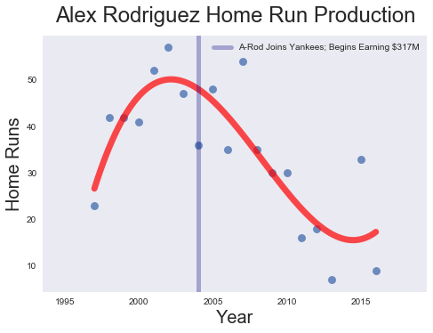

**The Bright Side of Failure; The Downside of Speed; and other Cool Baseball Observations**

As discussed in a previous [post](https://mistercoffey.github.io/CoolCorrelations/), correlations describe the relationship between variables, and are often described as a single number called ***r***. An r = 1 or -1 describes the  the strongest possible linear correlation between two variables. An r = 0 describes the weakest possible relationship.

Baseball has its share of cool correlations, the most famous of which is the extremely strong relationship between team wins and run differential.

Run differential is the difference between the runs scored by a team, and the runs allowed.  With an r of 0.934, the win/run differential relationship is so linear, that a team with a season run differential of 100 can expect to win 90+ games. In fact, this correlation is a basis for the “moneyball” style of baseball management. Teams acquire players that will maximize this run differential with the expectation that it will in turn deliver a certain number of wins.

*(The strong linear relationship between wins and run differential)*

While conducting my own research using the [Sean Lahman](http://seanlahman.com/) database, I discovered a few unexpected correlations. Though none inspire the same wonderment as the correlation between divorce in [Maine](http://www.tylervigen.com/spurious-correlations) and the consumption of margarine (r=0.99), some made me scratch my head and think deeply about the game of baseball.  

**Baseball Correlation #1: You Have to Be in It to Lose It**

In baseball there is a strong positive relationship between success and failure.  

A strike out is probably a player’s best measurement of failure. A batter walks up to the plate. He swings, misses, and walks back to the dugout with a head hanging low. Or worse, a player stands motionless as the pitcher delivers a strike, in which case, the player walks back with a head hanging even lower.  

This very act of striking out is highly correlated with typical measures of player success, such as hits (r = 0.85), home runs (r = 0.82), and runs batted in, or RBI for short (r = 0.86).

In other words, the very act of trying and failing has a relationship with trying and succeeding.  Not surprisingly, the greatest failures in terms of strike outs are also among the most [recognizable names ](https://www.baseball-reference.com/leaders/SO_career.shtml) in baseball: Reggie Jackson (No. 1); Alex Rodriguez (No. 5); Sammy Sosa (No. 4); Derek Jeter (No. 14); and Mickey Mantle (No. 31).

*(Nothing describes the relationship between home runs and strike outs better than the career of Reggie Jackson. His most prolific years in terms of home runs were also among his most prolific in strike outs)*

Break down the relationship between home runs and strike outs and you will see why.

The greatest correlation with hits is the act of walking up to the plate and trying (r = 0.98). This also opens the door for failure, which is similarly correlated with stepping up to the plate (r = 0.89).

To be clear, strike outs do not cause home runs, but the underlying act of trying to swing for the fences has a relationship with success and failure.

In other words, the old adage -- you need to risk failure to succeed— holds very true in baseball. If you are not failing at baseball, there is a chance that you are not succeeding either.

**Cool Baseball Correlation #2:  Speed Doesn’t Pay**

Speed is a cherished skill in most sports. Baseball is no exception. The trouble is that speed has no correlation with salary in baseball.

*(Code for adjusting salary for inflation using easymoney)*

Stolen bases and triples are the hallmarks of speed in baseball. In fact, both are correlated (r = 0.64). When we examine speed and salary for individual players from 1997 through 2016, we find that triples have almost no correlation with salary (r=0.03). Stolen bases have a slightly higher correlation (r= 0.07), but it’s still extremely low.

Again, this does not prove a causal point. Sluggish base running does not result in a raise. Conversely, running like mercury around the bases will not get you cut from the team.

So why is there no correlation between speed and pay? When I asked my learned friends on social media, the consensus was that speed is age related, and younger players are simply paid less than seasoned veterans. Indeed, many are subject to the Major League Baseball League [minimum salary](https://www.statista.com/statistics/256187/minimum-salary-of-players-in-major-league-baseball/), which was $507 million in 2016.

Compare for example, rookie [Jose Peraza](https://www.baseball-reference.com/register/player.fcgi?id=peraza004jos) of the Cincinnati Reds with seasoned veteran [David Ortiz](https://www.baseball-reference.com/players/o/ortizda01.shtml) (“Big Papi”) of the Boston Red Sox.  In 2016, Peraza earned the league minimum and stole 21 bases.  In contrast, Big Papi earned $16 million that year, but stole a paltry two bases. Therefore, if you want to get paid, it probably pays to stick around long enough in baseball to slow down.

*(Papi Style: David Ortiz rounds the bases slowly. Picture: Wikipedia)*

**Cool Baseball Correlation #3: Attendance Is in the Stars**

Fans love the long ball above all else, but it’s possible that fans love a star with a big fat salary even more.

Fan attendance has a higher correlation with team salary (r= 0.73)  than it does with the long ball (r=0.31). Salary even has a higher correlation with attendance than wins (r = 0.48). More surprisingly, the correlation for salary and attendance is three times that for attendance and World Series Wins.

Puzzling. My initial thought was that a strong relationship would exist between player salary and home runs, and this would in turn explain the relationship between attendance and salary. This is not the case: The correlation between salary and home runs is weak to moderate.

My best theory is that fans love stars.  While home runs can make a player a star, home runs wane as players age. Many home run hitters have long term contracts that keep the level of pay somewhat constant even though performance may be in decline. The rate of pay therefore becomes divorced from home run production, while stardom might not. Babe Ruth is as much a star today as he was when he 60 home runs in 1927.

Look at the career of Alex Rodriguez (“A-Rod”). A-Rod’s home runs rose in the late 1990s, leading many to conclude that he was the best player in baseball.  A-Rod’s performance in turn led to an historic contracts with the Rangers and Yankees that made him the highest paid player in baseball.  Indeed, [*Sports Illustrated*](https://www.si.com/mlb/2016/08/11/new-york-yankees-alex-rodriguez-contract) reported that the Yankees paid A-Rod close to $320 million between 2004 and 2016.

*(A-Rod’s home run production rose quickly then declined slowly. The uptick towards the end occurred after A-Rod's long suspension from baseball. Some speculated that the rest helped A-Rod’s home run production, putting it on par with his performance 10 years prior)*

As A-Rod aged, his home run production declined, as demonstrated by the above chart. By 2008, A-Rod was earning over $20 million a year, even though his home run production was less than it was 10 years prior.

The one thing A-Rod did have was name recognition. He was a star, both famous and infamous. Fans were still showing up in 2012 to see the player who hit 57 home runs in 2002.

Of course, this is just a theory.

**Cool Baseball Correlation #3: When It Comes to Home Runs, Not All Sacrifices Are Created Equal**

There are two types of sacrifices in baseball: Sacrifice Flies, and Sacrifice Hits. A sacrifice fly typically occurs when an outfielder catches a ball, and a base runner scores on the play.

*(Most know Cal Ripken, Jr. for his record 2,632 consecutive games played. He also holds the American League record for most career sacrifice flies (127). The great Hank Aaron holds the National League record (113) while [Eddie Murray](http://www.baseball-almanac.com/recbooks/sacrifice_flies_records.shtml) holds the MLB record (128). Picture: Wikipedia)*

A sacrifice hit is similar except that the batter typically bunts and advances a base runner. The runner does not need to score.

Aside from minor scorekeeping differences, there is a big difference between these two sacrifices: Sacrifice Flies are strongly correlated with home runs, while sacrifice hits are not. In fact, bunts have a very weak negative correlation with home runs. (r = - 0.14).

Shouldn’t we expect that both sacrifices to have the same correlations with home runs? Even if they are not similar, should we at least expect bunts to be positively correlated with home runs.

Not really.

One thing at which a home run hitter excels is hitting the ball deep, a quality needed for a well-executed sacrifice fly. Power is not a skill needed for a bunt. Why waste a power hitter’s plate appearance on a bunt when that slugger can move base runners with home runs?  By way of example, Yankee Aaron Judge had 32 home runs as of the 2017 All Star break, and not a single bunt.  

Similarly, a player lacking in power might bunt because he or his manager knows that he cannot reach base. Think of a pitcher in the National League who wants to advance a runner, but has a low batting average.
