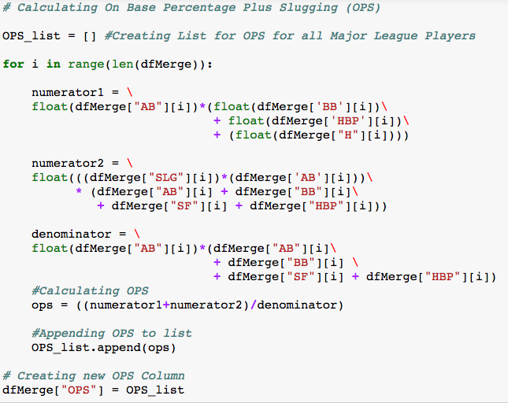
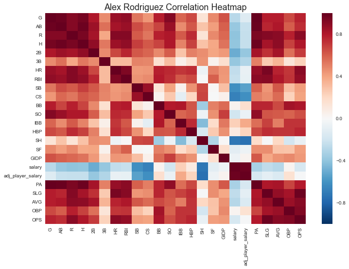
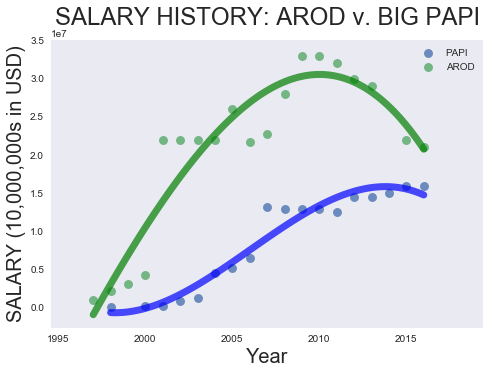
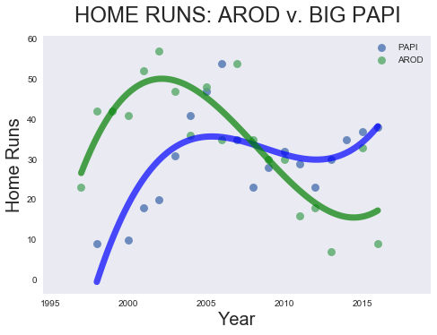

**Surprising Negative Correlations between A-Rod’s Pay and Performance**

In a previous [post](https://mistercoffey.github.io/BaseballCorrelations/), I discussed cool correlations in baseball, the coolest of which was the strong positive correlation between fan attendance and team salary, and the moderate positive correlation between attendance and performance.

My theory is that pricing in baseball tends to be backward looking, not forward looking. Players in their prime are paid the league minimum (approx. $500,000), while veterans lock in high salaries through long-term contracts, as evidenced by the career of Yankee Alex Rodriguez (“A-Rod”).

To demonstrate this, I used data from the Sean Lahman Baseball database, and added new features such as inflation adjusted player salary, On-Base Percentage, Slugging, Average, and On-Base Percentage Plus Slugging.

*(Python code for calculating OPS. [OPS](http://m.mlb.com/glossary/standard-stats/on-base-plus-slugging) reveals a hitter's ability to reach base and hit for power)*

This post digs deeper into the relationship between salary and performance, examining the career of Alex Rodriguez (“A-Rod”) in more detail, and comparing it with that of David Ortiz (“Big Papi”) of the Red Sox.

While I was expecting to find a weak to moderate correlation between A-Rod’s performance and pay, surprisingly, much of A-Rod’s performance correlated negatively with his pay.

Not only is there a weak negative correlation between adjusted salary and home runs (r = - 0.07), there are weak to moderate negative correlations between performance and pay, including hits (r = - 0.23),  doubles (r = - 0.38),  and RBIs (r = - 0.07)

*(The above heatmap reveals the correlations over A-Rod's career.  Red reveals positive correlations; Blue reveals negative correlations. Notice the swath of blue revealing the non-existant/negative correlations between pay and performance)*

There were two areas where there were moderate correlations between A-Rod’s pay and performance: Intentional walks and hits by pitch. The more A-Rod was paid, the more respect, if not anger, he received from opposing pitchers, especially from those ruffians in [Boston.](https://www.youtube.com/watch?v=dNvh8duFn3s)

The extreme disrespect dealt to A-Rod by the Red Sox made me wonder how A-Rod’s pay-performance correlations compared to that of Big Papi.

To this Yankee fan’s surprise, Big Papi’s performance was positively correlated with his pay.  While this is what we would expect from a typical baseball player, I was expecting Big Papi, with his big $16 million paycheck to have a non-existent, if not negative correlation with performance.

Instead, Big Papi’s performance was better than league-wide correlations. Papi's pay had a stronger correlation with walks (r=0.50) and hits (r = 0.46), when compared with MLB-wide correlations for walks (r = 0.28) and hits (r = 0.24).

There are of course plausible answers for the differences in pay-performance correlation between A-Rod and Big Papi.

First, Big Papi and A-Rod had much different pay trajectories. A-Rod was always paid more than Papi. A-Rod quickly became the highest paid player in baseball, and still holds the record for the highest career earnings. Big Papi was always well compensated, but his earnings rose steadily over the course of his career. Even as A-Rod’s pay dropped, he was still paid more than most players, and he was still paid more than Papi.

*(A-Rod was highly paid for most of his career, but as his pay peaked and declined, Big Papi's pay trajectory for the most part moved upward)*

Second, A-Rod and Big Papi performed differently at the end of their careers. A-Rod’s performance dipped considerably as he aged, while Big Papi experienced a renaissance of sorts in his final year.  A-Rod played third base, a demanding position. Big Papi was a designated hitter, a non-position that allows the player to relax on the bench while his teammates destroy their knees, hamstrings, feet and shoulders on the field.

*(The above graph reveals the difference in home run production between Papi and A-Rod. Big Papi's final year in baseball was among his most productive; A-Rod's final year was among his worst)*

Still, I was not expecting such a string of negative correlations with respect to A-Rod’s career.  This begs the question of whether Big Papi was perhaps underpaid and A-Rod overpaid. Perhaps it also reveals the acuity with which the Red Sox front office approached the payment of one of its biggest stars. These are musing for another post.
