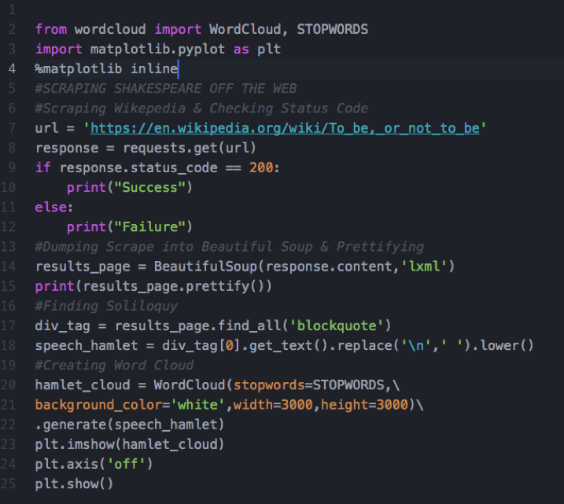
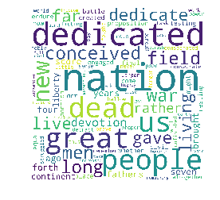
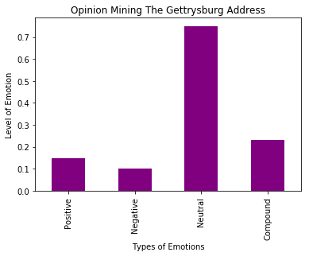
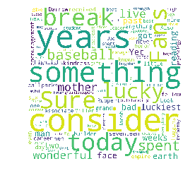
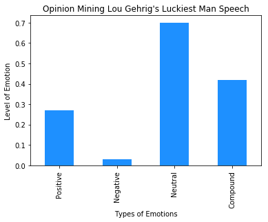
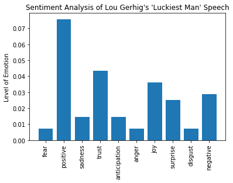

**Opinion Mining Shakespeare, Lincoln and Gehrig**

On July 4, 1939, Lou Gehrig delivered what is considered one of the greatest speeches in US history. What made this speech so memorable? It turns out machine learning can give us a number of insights.

**Background**

In the late 1930s, Gehrig was baseball’s most durable and productive player.  He appeared in six World Series and seven All-Star games. He won the coveted triple crown (highest batting average, most home runs and most RBIs in a season), and was inducted into the baseball Hall Fame. Perhaps his greatest achievement was his refusal to take a day off from baseball. Gehrig held the record for most consecutive games played for over 50 years.

A few months prior to delivering his speech, Gehrig shockingly took himself out of the line-up after playing in 2,130 consecutive games.  In June, doctors diagnosed Gehrig with ALS aka Lou Gehrig’s Disease. The prognosis was grim.

The Yankees honored the man they called the “Iron Horse” that July 4th with a so-called Appreciation Day. This was the Yankee organization’s opportunity to say thank you to Gehrig, and Gehrig’s opportunity to bid farewell to his loyal Yankee fans farewell.  

The speech Gehrig delivered on that Independence Day was so moving, and his career so celebrated, that Hollywood memorialized it in the film Pride of the Yankees starring [Gary Cooper.](https://www.si.com/mlb/2017/06/21/lou-gehrig-gary-cooper-pride-of-the-yankees-book) Author [William Safire](https://books.google.com/books?id=dBJpAwAAQBAJ&pg=PT480&lpg=PT480&dq=william+safire+best+speeches+gehrig&source=bl&ots=yqFXXJOsRG&sig=bcanK-WMUt1WdOtpZ1VR4fYdUUs&hl=en&sa=X&ved=0ahUKEwiVsfT10bHWAhUHNSYKHQQPD34Q6AEIMDAB#v=onepage&q=william%20safire%20best%20speeches%20gehrig&f=false )included the speech in his anthology of great speeches, and it continues to be a [topic of regular internet conversation](https://www.washingtonpost.com/entertainment/books/the-truth-behind-the-legend-of-lou-gehrig/2017/09/14/4e106770-94b5-11e7-aace-04b862b2b3f3_story.html?utm_term=.7f23220a7287) 75+ years later.

We remember it as the *Luckiest Man* speech, because Gehrig declares himself the "luckiest man on the face of the earth notwithstanding his impending passing. It was brief. It was humble. It was moving. It was timeless.  The speech transcends sports. The echoing lines of Gehrig’s farewell can evoke emotion in even the most ardent sports hater.

**Exploring Text through Machine Learning**

What accounts for the enduring nature of the *Luckiest Man* speech?  It’s easy to wax eloquent on its humility, but which words in the text makes this speech resonate three quarters of a century after its delivery?  This is where machine learning can provide some help.

An exciting area of machine learning is opinion mining or sentiment analysis. Using dictionaries of emotions associated with words, one can use algorithms to mine text and determine the sentiment of the writer.

There are several dictionaries available to assist in the opinion mining process. One is the NRC Sentiment and emotion Lexicon, the creators of which (Saif M. Mohammad & Pierre Charron) generously granted me a limited use their [lexicon.](http://sentiment.nrc.ca/lexicons/)

Another is VADER, short for Valence Aware Dictionary and sEntiment Reasoner.

As one can imagine, opinion mining can help determine the opinions of posts on social media. It can also break down the nature of all text, even speeches. VADER is specifically tuned to mine social media, but [“it works well on texts from other domains”.](https://github.com/cjhutto/vaderSentiment.)

I am personally excited about opinion mining given my background as a speechwriter, as it can reveal the tenor of a speech, and even compare and find similar speeches. If you want to sound like Ronald Reagan, but sentiment analysis tells you that you sound like Jimmy Carter, then it is time for a vigorous re-write.

**Mining Shakespeare**

First, let’s demonstrate of the power of sentiment analysis by running it on well-known texts.

Though technically not a speech, Hamlet’s soliloquy has among the most recognizable passages in theater and literature. Delivered by Hamlet in the eponymous play, the soliloquy reveals the thoughts of an indecisive prince as he contemplates suicide (“To be or not be…”).  Hamlet vacillates between thoughts of life and death, yearning for death while grasping for life. It is also further evidence of Hamlet’s paralyzing indecision.  The soliloquy is similar to the *Luckiest Man* speech in that both include a contemplation of death.

(*Code for a quick scrape of Wikipedia to find text of Hamlet’s soliloquy & create a word cloud*)

**Hamlet Word Cloud**

Let’s first reduce Hamlet’s soliloquy to a word cloud.

(*The Hamlet word cloud suggests mixed emotions about life and death*)

A word cloud is a visualization technique that provides a cursory analysis of text. The bigger the word in a word cloud, the more the word is used.  

Analysis of Hamlet’s word cloud gives us some insight into the temperament of his soliloquy. The words ‘death’, ‘die’, and sleep jump out from the text, and these words to some extent capture the mood of Hamlet’s soliloquy. It’s easy to sense that the mood is depressing, but the word cloud does not give us a detailed analysis of the emotions. Is it more positive than negative? Do the emotions express more anger than fear, more joy than sorrow?

(*VADER Analysis of Hamlet’s soliloquy. Look at the compound meaning of the passage; it is negative*)

Sentiment analysis can readily dissect Hamlet’s emotions. Using VADER sentiment analysis and few lines of code*, we can explore the complex emotions of Hamlet’s soliloquy. As demonstrated by the visualization below, Hamlet’s emotions are for the most part neutral, meaning that the words have neither positive nor negative emotions. It’s interesting -- perhaps coincidentally so -- because Hamlet was emotionally paralyzed and incapable of taking action.

The remainder of text is split between positive and negative words, with negative emotions edging out the positive. This makes sense, as Hamlet does not long for life as much as he fears death. But the compound meaning — the overall emotion--  is negative.  This is the only possible emotional sentiment of a speech that is very nearly a suicide letter.

NRC sentiment analysis gives more detailed insight into the emotional state of Hamlet.  Breaking down the meaning of words to a percentage of the text, we see that Hamlet’s emotions are both positive (2.5 percent) and negative (2 percent). Though this is slightly different than the VADER analysis, it is still very perceptive as Hamlet is thinking of death, while deciding to live. Hamlet is also expressing a considerable amount of fear, which is accurate given that he is afraid of what death will bring. There are other emotions that are not immediately evident, such as surprise, but there are others that are obvious in the text, such as anger.   

(*Sentiment Mining Hamlet’s soliloquy with the NRC Sentiment Lexicon. Notice the mixed emotions of the emotionally paralyzed Hamlet*)

In short, the NRC breaks down Hamlet’s soliloquy very well.

**Mining Lincoln**

Let’s apply sentiment analysis to perhaps the greatest speech in American history: [*The Gettysburg Address*.](http://www.loc.gov/exhibits/gettysburg-address/)

Delivered by Abraham Lincoln in 1863 following the bloodiest battle of the US Civil War, the *Gettysburg Address* eulogized the dead, and embraced interminable freedom and liberty. It is a speech filled with hope and sadness.

Like the *Luckiest Man* speech, the *Gettysburg Address* is brief, and like Hamlet’s soliloquy, it is filled with mixed emotions, in this case, grief for the dying, and faith in the future.  

(Word cloud of the *Gettysburg Address*)

A word cloud gives us some insight into *Gettysburg Address*, though it’s not definitive. Like Hamlet’s soliloquy, the Lincoln word cloud reveals thoughts of life and death. In addition, it shows words of war, devotion, greatness and dedication.  Clearly, it deals with complex emotions, but the word cloud cannot analyze these emotions for us.

VADER sentiment analysis does a better job of sensing mixed emotions in Lincoln’s speech, though positive emotions  (0.15) have a slight edge over negative emotions (0.10). Unlike Hamlet’s soliloquy, Lincoln’s *Gettysburg Address* has a positive overall positive sentiment. This seems accurate, as Hamlet spends most of the soliloquy contemplating death, deciding against it on account of a paralyzing fear of the unknown. Lincoln in contrast muses over death by expressing hope for the future.

(VADER analysis of the *Gettysburg Address*. It reveals the mixed emotions of Abraham Lincoln’s *Gettysburg Address*. Unlike Hamlet, which had a negative compound sentiment, the Gettysburg Address has a positive compound sentiment)

NRC Sentiment analysis can dig even deeper into the *Gettysburg Address*, and shows that the positive emotions (0.034) far outweigh the negative emotions (0.015). We see negative emotions of sadness, anger and disgust, but they are dwarfed by the positive emotions of trust, anticipation and joy. It is a very short ride from the horrific depths of war to anticipation for the future.  What a powerful journey.

**Opinion Mining the *Luckiest Man***

Now that we see the power of Sentiment Analysis, let’s return to the *Luckiest Man* speech. In many respects, the *Luckiest Man* is like Hamlet’s soliloquy, as Gehrig is delivering it in contemplation of death. There is one key difference: the prince had a choice whether to embrace death; Lou Gehrig did not as his imminent demise was fairly certain.

The *Luckiest Man* speech is also like the *Gettysburg Address* as it is a panegyric of sorts, but one where the man delivering the speech is compelled to eulogize himself.  It is also like the *Gettysburg Address* as Gehrig, like Lincoln, neither ignores the morbid nature of the day, nor refuses to let the melancholy of the moment subdue any positive emotions.

*Luckiest Man Word Cloud*

A word cloud of the *Luckiest Man* speech tells us little about the mood of the speech. This is partly because of the Gehrig’s heavy reliance on the rhetorical devices of epistrophe and anaphora; that is, he repeats words at the beginning and end of  sentences. He uses anaphora at the beginning of the sentence with the word “consider” and he uses epistrophe by repeating the idiom “that’s something.” These devices muddy the word cloud, making it difficult to interpret.

(*Word cloud of the Luckiest Man speech. Heavy use of rhetorical devices of epistrophe and anaphora make it the word cloud difficult to interpret*)

In a previous [post](https://mistercoffey.github.io/Kickster/), I reported my progress at building an algorithm predicting the probability of success on Kickstarter. I was able to build a model that had 68 percent accuracy on a test set. I also attempted to successfully predict the probability of success with two live Kickstarter campaigns: *[Love Found]*(https://www.kickstarter.com/projects/makehistory/lovefound-by-jon-rua) and *[Renegade Repos]*(https://www.kickstarter.com/projects/1707992326/renegade-repos-web-show?ref=nav_search).

Vader analysis does a better job than a word cloud of discerning Gehrig’s mood. It tells us that the *Luckiest Man* speech has negative emotions, but these emotions are outweighed by the positive emotions. The compound meaning is actually very positive.

(*The compound emotions of Gehrig’s Luckiest Man speech is extremely positive.*)

When we delve deeper into the *Luckiest Man* speech using NRC sentiment analysis, we find evidence of negative emotions, in addition to an even stronger reliance on  positive emotions. Indeed, positive sentiments are twice that of the negative ones. Emotions of fear, anger and sadness are present, but they are not at the same level as feelings of trust and joy.

(*Though overwhelmingly positive, the Luckiest Man speech harbors some complex, conflicting emotions*)

What we learn from mining the *Luckiest Man* speech is that it, like the *Gettysburg Address*, does not submit to the somber nature of the moment. It has a surprising twist. He acknowledges the obvious—Gehrig’s imminent death--but refuses to submit to it.

Perhaps this is the great secret of the *Luckiest Man* speech, and the great secret to the *Gettysburg Address*: Both speeches remind the listener of the impermanence of the human condition, yet deliver an abundant hope in the present and the future.  

Imagine the alternatives to these speeches. Lincoln could have easily dwelled on the loss of thousands of lives, and called for revenge. Lincoln could have also given a perfunctory “thank you” and harped on some legislative agenda.  Similarly, Gehrig could have dwelled on his so-called “bad break” of ALS. He too could have said “thank you” for the afternoon, acknowledged the dignitaries in attendance, and walked-away from the microphone.  Neither avoided the discomfort of discussing mortality. Both acknowledged negative but dwelled on the positive. This perhaps is what makes both speeches among the most cherished in US history.

**Conclusion**

As we can see, opinion mining has great potential for dissecting speeches, and is a great resource for speechwriters.  In the example above, bother NRC and VADER were able to parse through texts replete with complex, mixed emotions.  VADER did an excellent job of revealing overall meaning, while NRC did a better job of revealing more nuanced emotions.

While opinion mining cannot replace the art of rhetoric, it can help writers decide which emotions to hit and which to avoid.  It can also give instant feedback on a speech, and allow writers to compare their work to other similar speeches.

* This post modified functions created by Dr. Hardeep Johar of Columbia University for his Data Analytics in Python class
