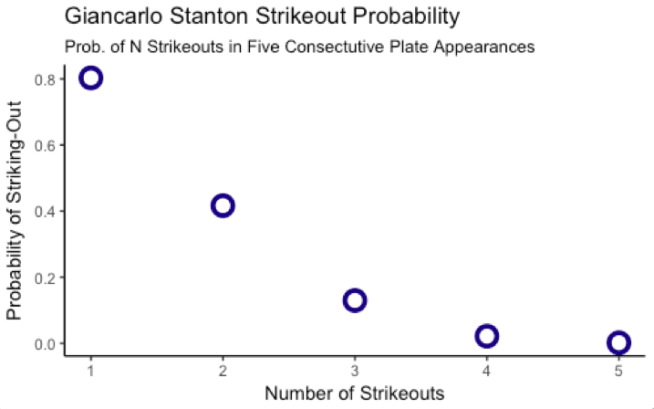

**The Rarity of Giancarlo Stanton’s Extreme Failure**


Baseball is a game of failure. Hits are rare. Anything but a hit is not. Even the greatest players fail about 70 percent of the time.  Though there have been players who have failed 60 percent of the time, we have not seen one since the autumn of 1941.

Though failure is woven into the fabric of our national pastime, extreme failure is not.  We will see players strikeout with some regularity, though they seldom strikeout five times in a game. It’s even rarer for a player to strikeout five times in two separate games.

This is exactly what Giancarlo Stanton of the New York Yankees did at the beginning of the 2018 baseball season. He struck out five times in five consecutive plate appearances, not once but twice. Those spectators who witnessed this event saw something that few have seen in the 117 years of MLB history.

Players call five consecutive strikeouts the “Platinum Sombrero”.  We know it is rare, but how rare is it for Giancarlo Stanton? Using a Monte Carlo simulation, we find that it is highly probable that Stanton will strikeout at least once in five plate appearances. It is even possible for Stanton to record at least one platinum sombrero by this time in his career. What’s totally improbable is that we would ever see Stanton deliver a double platinum sombrero. This is a rare feat of failure, even for a player like Stanton who whiffs often.


(*Giancarlo Stanton scoring a run as a Miami Marlin. Source: Wikipedia Commons*)

**Background**

The 2018 baseball season is quickly becoming the year of the strikeout. Players for the first time are recording more strikeouts than hits. As I have observed on this [blog](https://mistercoffey.github.io/BaseballCorrelations/), there is a high correlation on the baseball field between success and striking-out, and [clubs know it.](https://www.wsj.com/articles/the-baseball-season-when-strikeouts-overtook-hits-152509829. https://www.wsj.com/articles/the-baseball-season-when-strikeouts-overtook-hits-1525098290) Teams are loading their dugouts with sluggers, at the same time that they are filling bullpens with strike-out artists, creating a high strikeout environment in the process. The high strikeout season looks like the new normal.

**Stanton**

Yankee slugger Giancarlo Stanton contributed to the 2018 strikeout tally by recording a double platinum sombrero; he struck-out five consecutive times, not once, but twice.  

Stanton’s double platinum sombrero was something extraordinary:

>Such games, sometimes called platinum sombreros, are quite rare. There have been two other five-strikeout games this season, by Tim Beckham of the Baltimore Orioles and Chad Wallach of the Miami Marlins. There were five in all of 2017, eight in 2016 and three in 2015. The most five-whiff games in a career is just four, by Sammy Sosa from 1990 to 2003 ([New York Times, 4/9/2018](https://www.nytimes.com/2018/04/09/sports/baseball/giancarlo-stanton-five-strikeouts.html)).

While observers are abuzz with the rarity of this event, sports writers are omitting the actual probability of Stanton achieving one golden Sombrero (four strikeouts in a game), let alone two platinum sombreros.

Stanton’s statistics are abundant in terms of success and failure. He finished 2017 as the league home run leader (59 HR). He was also ranked 17th in terms of strikeouts (In fairness, Stanton was [tied](http://www.espn.com/mlb/stats/batting/_/year/2017/sort/strikeouts/order/true) for 17th with three other players) Stanton’s Yankees teammate Aaron Judge (NYY) was the league leader in strikeouts in 2017, striking-out a whopping 203 times.

**Coding A Monte Carlo Simulation**

But does Stanton’s high rate of failure translate into extraordinary failure?
A quick Monte Carlo simulation can confirm the rarity of a Stanton platinum sombrero. https://en.wikipedia.org/wiki/Monte_Carlo_method

Monte Carlo simulations repeat the same event a preset number of times.  Think of 20 random coin tosses repeated 10,000 times. We know that probability of a coin flipping heads is 0.50.  But what is the probability that the coin flips heads 10 in a row? We might expect it to be five, but we often find variation in our flips. Toss a coin 10 times and you might see seven heads. Toss it another 10 times we might see only one head. This implies a 0.70 or 0.10 probability, even though we know it should be 0.50. We simply haven’t tossed the coin enough to see the expected and actual values to [converge](https://en.wikipedia.org/wiki/Law_of_large_numbers) to the .50 probability.
A Monte Carlo simulation overcomes the imprecision of a small sample and flips the coin 10 times. It then recreates this 10 flip scenario thousands of times. From this larger simulation, we can easily find the percentage of times the coin toss produces 10 heads, nine heads, eight heads, etc.

Statisticians often use Monte Carlo to simulate more complex problems, such as the risks related to retirement planning. Some statisticians are even using it to [simulate baseball games](https://tlo.mit.edu/node/3041/pdf) and/or [entire seasons](https://fivethirtyeight.com/features/how-our-mlb-predictions-work/).

In the case of Stanton, we will simulate five consecutive plate appearances 10,000 times using Stanton’s lifetime strikeout numbers.

Stanton has whiffed 27 percent of the time over the course of his career. Plugging the code into R, we can create a Monte Carlo simulation very quickly. Though I prefer Python to R, I like R for quick statistical analysis and visualization. I also like to use it from time to time so I do not forget it.

First, we write a function simulating five plate appearances based on Stanton’s lifetime strikeout probability. We will code a strikeout with a one. We will use a zero to code anything but a strikeout (hit, putout, fly ball, base on balls, etc.).


```
{R Function: Monte Carlo Simulation}

#Probability of Stanton Striking-Out (Lifetime)

p_Strike_Out <- 0.27

#Probability of Stanton not Striking-Out (Lifetime)

p_No_Strike_out <- 1 - p_Strike_Out

#Setting Seed

set.seed(1)

#Monte Carlo Simulation (10,000 replications)

B <- 10000
results_stanton <- function(n){
  replicate(B,{
  simulated_so <- sample(c(0,1), 5,
                         replace = TRUE,
                         prob = c(p_No_Strike_out, p_Strike_Out))
  sum(simulated_so)>=n

  }
  )
}

```
(*The function in R recreates five consecutive plate appearances based on a probability that Stanton would strike out 27 percent of the time.*)

Second, we write a function providing us with the mean for the number of strikeouts from our simulations.

```
{R Functions: Mean of Simulation Strike Outs}

prob_stanton <- function(n){
  return(mean(results_stanton(n)))
}
```

Third, we create a vector representing the number of consecutive strikeouts. We apply the vector to our simulation using the R lapply() function.

```
{R Functions: Applying Strike-Out Simulation to n Strikeouts}

#Creating vector representing consecutive strike outs

vec <- c(1,2,3,4,5)

#Applying the function to our vector and building a data frame

applier <-lapply(vec,prob_stanton)

print(applier)
```
(*The lapply function in R can apply our other functions efficiently and give us the probability that Stanton would hit one, two, three, four or five strikeouts in five consecutive plate appearances.*)

Finally, we visualize our distribution of probabilities:



(*The probability of Stanton striking-out once in five consecutive plate appearances is very high. The probability of striking-out five times is low.*)

As we can see, there is a very high probability that Stanton will strike out at least once in five consecutive plate appearances (0.79 percent). In fact, sports fans are more likely to see a Stanton strikeout than a Stanton home run. It’s even more likely for Stanton to strikeout twice in five plate appearances (0.41) than to get a hit.   

What is less likely from Stanton is a golden sombrero (0.02) or a platinum sombrero (0.0012), though neither are impossible. In fact, if we break Stanton’s lifetime plate appearances (4,252) into blocks of five (850), we should already expect at least one platinum sombrero from the slugger.

Still, two platinum sombreros by Stanton are highly improbable. Assuming that each platinum sombrero is independent of the other, we can simply multiply the probability by itself (0.0012 * 0.0012) to get the probability of two: The probability is an exceedingly low at 1.44e-06.  It is so improbable that we should never expect to see Stanton do it over the course of his career.

**Risks**

While our simulation found that a double platinum sombrero is rare, the simulation reveals a higher probability for the platinum sombrero (0.0012) than I expected.  At this rate, one would expect them to happen with greater regularity in MLB.

Batting orders may hold the answer to this higher than expected rate. Some players see more plate appearances than others. A player batting ninth might have three or four plate appearances in a game, while a player batting first in the lineup may have four or five. There simply is less opportunity for players down the lineup to have five strikeouts.

Likewise, players batting at the top of the lineup have different styles of play, making a platinum sombrero even less likely.  On the one hand, a leadoff batter is more likely to make contact with the ball than swing wildly for the fences. On the other, a player like Stanton batting cleanup is more likely to swing for the fences, making strikeouts more likely. This further limits the number of players susceptible to the platinum sombrero, and these factors should severely depress the number of league wide platinum sombreros

Another answer might be that consecutive plate appearances are not independent, at least not with respect to consecutive strikeouts.  A platinum sombrero is the subject of ridicule. If a player has a golden sombrero in a game, he might cease swinging for the fences and simply make contact with the ball so as to avoid the bad press and boos.

A final risk is the probability we used for Stanton’s strikeouts. Stanton had a bad April. His probability of striking out based on his updated numbers is 0.34. This gives us much higher probability of a golden sombrero (0.05) and a platinum sombrero (0.0054). These numbers are low, as is the probability of a double platinum sombrero (2.916e-05).

Moreover, the fact that Stanton's platinum sombrero occurred during a a high strike-out period in baseball should make one reconsider using lifetime statistics in a Monte Carlo simulation. We could be entering a new phase of baseball where strikeouts become so much more common, that platinum sombreros become more likely. Though an outlier now, Stanton's platinum sombreros may be a harbinger of changes in the game.

**Conclusion**

Platinum sombreros are rare in major league baseball, but not improbable. A Monte Carlo simulation confirms that we should already expect at least one from Stanton at this point in his career.  A double platinum sombrero is exceedingly rare but Stanton produced one in April 2018.  Fans should take joy in witnessing such an infrequent event. This is uncommon failure, even for baseball.

* This post modified a function created by Dr. Irizarry of Harvard University for his HarvardX Data Science: Probability class.
