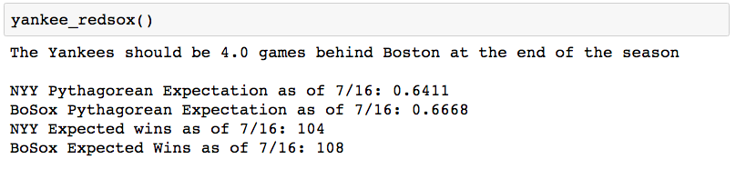

**More Fun with the Pythagorean Expectation**


In my previous [post](https://mistercoffey.github.io/Pythag/), I presented functions that predicted the 2018 wins for the New York Yankees and Boston Red Sox. This post presents a new function that condenses those previous two functions into one. The function also provides the number of projected "games back" the Yankees and Red Sox will be from eachvother at the end of the season. Perhaps it's redundant information, but it was fun to code.

```
def yankee_redsox():

    import datetime as dt
    from bs4 import BeautifulSoup
    import requests

    # CREATING TIME VARIABLES

    today = dt.datetime.today()
    now = str(today.month) + '/'+ str(today.day)
    year = str(today.year)

    # SCRAPING RED SOX STATS FROM WEB

    urlBos = \
    'https://www.baseball-reference.com/teams/BOS/'\
    + year +'.shtml'
    responseBos = requests.get(urlBos)

    soupBos = BeautifulSoup(responseBos.content,'lxml')
    statsBos = \
    soupBos.find_all('p')[3].get_text()\
    .strip('Pythagorean W-L:\n\t')
    runs_scoredBos = float(statsBos[7:10])
    runs_allowedBos= float(statsBos[17:20])

    winsBos = []
    lossBos = []
    staterBos =statsBos[0:6]
    for i in staterBos:
        if staterBos[2] == '-':
            winner = staterBos[0:2]
            winner = winner[0]+winner[1]
            loser = staterBos[3:5]
            losers = loser[0]+loser[1]
            winsBos.append(winner)
            lossBos.append(losers)

    Bos_wins = float(winsBos[0])
    Bos_loss = float(lossBos[0])
    Bos_games =     Bos_wins + Bos_loss
    Bos_exponent = ((runs_scoredBos + runs_allowedBos)/Bos_games) ** .287
    Bos_Pythagorean_Expectation= \
    round(1/(1+((runs_allowedBos/runs_scoredBos)** Bos_exponent)),4)
    Bos_Expected_Wins =   round(Bos_Pythagorean_Expectation * 162,4)
    Bos_Expected_losses = (162- Bos_Expected_Wins)


    #SCRAPING YANKEE STATS FROM WEB

    url = 'https://www.baseball-reference.com/teams/NYY/'+ \
    year +'.shtml'

    #Scraping baseball website for statistics

    response = requests.get(url)

    #Creating 'Beautiful Soup'

    soup = BeautifulSoup(response.content,'lxml')

    #Pulling runs scored and runs allowed from soup

    stats = soup.find_all('p')[3].get_text()\
    .strip('Pythagorean W-L:\n\t')
    runs_scored = float(stats[7:10])
    runs_allowed= float(stats[17:20])

    # CALCULATING GAMES PLAYED

    wins = []
    loss = []
    stater =stats[0:6]
    for i in stater:
        if stater[2] == '-':
            winner = stater[0:2]
            winner = winner[0]+winner[1]
            loser = stater[3:5]
            losers = loser[0]+loser[1]
            wins.append(winner)
            loss.append(losers)

    yankee_wins = float(wins[0])
    yankee_loss = float(loss[0])
    games =     yankee_wins + yankee_loss

    #CALCULATING EXPONENT USING PYTHAGANPAT

    exponent = ((runs_scored + runs_allowed)/games) ** .287

    #CALCULATING PYTH. EXPECTATION, EXPECTED WINS & LOSSES

    Pythagorean_Expectation= \
    round(1/(1+((runs_allowed/runs_scored)**exponent)),4)
    Expected_Wins =   round(Pythagorean_Expectation * 162,4)
    Expected_losses = (162- Expected_Wins)

    #CALCULATING GAMES BACK

    if Expected_Wins > Bos_Expected_Wins:

        win_dif = (Expected_Wins-Bos_Expected_Wins)
        loss_dif = (Expected_losses - Bos_Expected_Wins)
        summ = win_dif + loss_dif
        games_back = summ/2
        print\
        ("Boston should be {g} \
        games behind the Yankees at the end of the season".format(g=games_back))

    elif Expected_Wins < Bos_Expected_Wins:

        win_dif = int(Bos_Expected_Wins-Expected_Wins)

        loss_dif = (Expected_losses-Bos_Expected_losses)
        summ = int(win_dif + loss_dif)
        games_back = summ/2
        print\
        ("The Yankees should be {g} games behind Boston at the\
         end of the season".format(g=games_back))
    print(' ')                                                             
    print("NYY Pythagorean Expectation as of {d}: {p}"\
    .format(d= now,p= Pythagorean_Expectation))
    print("BoSox Pythagorean Expectation as of {d}: {p}"\
    .format(d= now,p= Bos_Pythagorean_Expectation))
    print("NYY Expected wins as of {d}: {p}".format(d= now,p= int(round(Expected_Wins,0))))                                    
    print("BoSox Expected Wins as of {d}: {p}".format(d= now,p= int(round(Bos_Expected_Wins,0))))         

```


(*[The Splendid Splinter](https://baseballhall.org/hall-of-famers/williams-ted) and the [Yankee Clipper](https://baseballhall.org/hall-of-famers/dimaggio-joe) put the Yankee-Red Sox rivalry aside and enjoy a little levity. Source: [Creative Commons](https://www.flickr.com/photos/97453745@N02/9082143731/in/photolist-4idr9b-4idp8Q-agxT1i-eQymV2)*)


I am sad to report that at the current levels of run production, my beloved Yankees will finish four games behind the Red Sox at the end of the season. Given that I write this during the All-Star Break, there is plenty of time for the Yankees to improve and overtake the Red Sox. Let's wish the Bombers the best.



(*The Pythagorean expectation tells us that the Yankees will finish four games behind the Red Sox at current levels of run production*)
