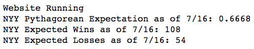

**More Fun with the Pythagorean Expectation**


In my previous post, I presented functions that predicted the 2018 wins for the New York Yankees and Boston Red Sox. This post presents a new function that condenses the two functions and provides the games back at the end of the season. Perhaps it's extraneous information, but it was fun to code.

```
def yankee_redsox():

    import datetime as dt
    from bs4 import BeautifulSoup
    import requests

    # PULLING RED SOX STATS
    now = str(today.month) + '/'+ str(today.day)
    year = str(today.year)
    urlBos = \
    'https://www.baseball-reference.com/teams/BOS/'\
    + year +'.shtml'
    responseBos = requests.get(urlBos)

    soupBos = BeautifulSoup(responseBos.content,'lxml')
    statsBos = \
    soupBos.find_all('p')[3].get_text()\
    .strip('Pythagorean W-L:\n\t')
    runs_scoredBos = float(statsBos[7:10])
    runs_allowedBos= float(statsBos[17:20])

    winsBos = []
    lossBos = []
    staterBos =statsBos[0:6]
    for i in staterBos:
        if staterBos[2] == '-':
            winner = staterBos[0:2]
            winner = winner[0]+winner[1]
            loser = staterBos[3:5]
            losers = loser[0]+loser[1]
            winsBos.append(winner)
            lossBos.append(losers)

    Bos_wins = float(winsBos[0])
    Bos_loss = float(lossBos[0])
    Bos_games =     Bos_wins + Bos_loss
    Bos_exponent = ((runs_scoredBos + runs_allowedBos)/Bos_games) ** .287
    Bos_Pythagorean_Expectation= \
    round(1/(1+((runs_allowedBos/runs_scoredBos)** Bos_exponent)),4)
    Bos_Expected_Wins =   round(Bos_Pythagorean_Expectation * 162,4)
    Bos_Expected_losses = (162- Bos_Expected_Wins)


    #YANKEE STATS

    url = 'https://www.baseball-reference.com/teams/NYY/'+ year +'.shtml'

    #Scraping baseball website for statistics

    response = requests.get(url)

    #Creating 'Beautiful Soup'

    soup = BeautifulSoup(response.content,'lxml')

    #Pulling runs scored and runs allowed from soup

    stats = soup.find_all('p')[3].get_text().strip('Pythagorean W-L:\n\t')
    runs_scored = float(stats[7:10])
    runs_allowed= float(stats[17:20])

    # Calculating games played

    wins = []
    loss = []
    stater =stats[0:6]
    for i in stater:
        if stater[2] == '-':
            winner = stater[0:2]
            winner = winner[0]+winner[1]
            loser = stater[3:5]
            losers = loser[0]+loser[1]
            wins.append(winner)
            loss.append(losers)

    yankee_wins = float(wins[0])
    yankee_loss = float(loss[0])
    games =     yankee_wins + yankee_loss

    #Calculating exponent using Pythaganpat

    exponent = ((runs_scored + runs_allowed)/games) ** .287

    #Calculating Pythagorean expectation, expected wins & expected losses

    Pythagorean_Expectation= round(1/(1+((runs_allowed/runs_scored)**exponent)),4)
    Expected_Wins =   round(Pythagorean_Expectation * 162,4)
    Expected_losses = (162- Expected_Wins)

    #Calculating Games Back

    if Expected_Wins > Bos_Expected_Wins:

        win_dif = (Expected_Wins-Bos_Expected_Wins)
        loss_dif = (Expected_losses - Bos_Expected_Wins)
        summ = win_dif + loss_dif
        games_back = summ/2
        print\
        ("Boston should be {g} \
        games behind the Yankees at the end of the season".format(g=games_back))

    elif Expected_Wins < Bos_Expected_Wins:

        win_dif = int(Bos_Expected_Wins-Expected_Wins)

        loss_dif = (Expected_losses-Bos_Expected_losses)
        summ = int(win_dif + loss_dif)
        games_back = summ/2
        print\
        ("The Yankees should be {g} games behind Boston at the end of the season".format(g=games_back))
    print(' ')                                                             
    print("NYY Pythagorean Expectation as of {d}: {p}".format(d= now,p= Pythagorean_Expectation))
    print("BoSox Pythagorean Expectation as of {d}: {p}".format(d= now,p= Bos_Pythagorean_Expectation))
    print("NYY Expected wins as of {d}: {p}".format(d= now,p= int(round(Expected_Wins,0))))                                    
    print("BoSox Expected Wins as of {d}: {p}".format(d= now,p= int(round(Bos_Expected_Wins,0))))         

```


(*The Pythagorean expectation tells us that the Yankees will finish four games behind the Red Sox at current levels of run production*)

I am sad to report that at the current levels of run production, my beloved Yankees will finish four games behind the Red Sox at the end of the season. Given that I write this during the All-Star Break, there is plenty of time for the Yankees to improve and overtake the Red Sox. Let's wish the Bombers the best.


Like any other Yankee fan, I hope, and perhaps expect that the Yankees will enter the playoffs. To assess the team's chances, I run the Yankees' Pythagorean expectation throughout the season.

At the risk of producing a glazed look in the eyes of those unfortunate enough to read this blog, I will do my best to explain: The [Pythagorean expectation](https://en.wikipedia.org/wiki/Pythagorean_expectation) is a simple formula used to predict a baseball team's winning percentage. It's based on a club's runs and runs allowed, and was first observed by Bill James, the godfather of sabermetrics. The formula is "Pythagorean" because is is similar the Pythagorean theorem.


(*The Pythagorean Expectation. Source: Wikipedia*)

Over the years, researchers modified the original formula, adjusting the exponent from 2.0. Some suggest using an exponent of 1.83. Other researchers suggest using a using an exponent based on a team's runs scored, runs allowed and games played. One such formula is the  so-called Pythagenpat. [Pythagenpat](https://en.wikipedia.org/wiki/Pythagenpat) takes the ratio of runs and runs allowed divided by the games played. The ratio is raised to the power of 0.287.

In any event, the Pythagorean expectation is spooky in that and does a remarkably good job of approximating a team's wins and losses. Want to see evidence of the great programmer in the sky? Play around with the Pythagorean expectation, and you will think that you are witnessing such evidence. Look into the formula's prescient crystal ball throughout the season and you will provide a good assessment of a club's end-of-season prospects. Though it's tough to read anything into the formula at the start of the season, it regresses towards the mean as the season progresses.

The trouble is, there is some leg work required to determine a team's expected wins. One has to go to a website and find a team's runs scored and runs allowed, in addition to the number of games played. Then one has to do the math. While it takes 10 minutes or so to assemble the information, do this every week and one has wasted a lot of time. Furthermore, each calculation provides a new vehicle for a miscalculation.

To remedy this, I created the python function below. It scrapes the web to find the latest statistics on the Yankees, then plugs that information into the Pythagorean expectation. It also adjusts the exponent using the Pythagenpat formula. It's quick to use and saves loads of time over the course of the season.


```
def pythagoreanNYY():

    #Importing libraries

    import pandas as pd
    import datetime as dt
    from bs4 import BeautifulSoup
    import requests

    #Creating flexible dates.

    now = str(today.month) + '/'+ str(today.day)

    year = str(today.year)

    #Creating URL

    url = \
    'https://www.baseball-reference.com/teams/NYY/'\
    + year +'.shtml'

    #Scraping baseball website for statistics

    response = requests.get(url)

    if response.status_code == 200:
        print("Website Running")
    else:
        print("Website Down")

    #Creating 'Beautiful Soup'

    soup = BeautifulSoup(response.content,'lxml')

    #Pulling runs scored and runs allowed from soup

    stats = soup.find_all('p')[3].get_text().strip\
    ('Pythagorean W-L:\n\t')
    runs_scored = float(stats[7:10])
    runs_allowed= float(stats[17:20])

    #Calculating games played

    wins = []
    loss = []
    stater =stats[0:6]
    for i in stater:
        if stater[2] == '-':
            winner = stater[0:2]
            winner = winner[0]+winner[1]
            loser = stater[3:5]
            losers = loser[0]+loser[1]
            wins.append(winner)
            loss.append(losers)

    yankee_wins = float(wins[0])
    yankee_loss = float(loss[0])
    games =     yankee_wins + yankee_loss

    #Calculating exponent using Pythaganpat

    exponent = ((runs_scored + runs_allowed)/games) ** .287

    #Calculating Pythagorean expectation
    #Calculating expected wins & expected losses

    Pythagorean_Expectation= \
    round(1/(1+((runs_allowed/runs_scored)**exponent)),4)
    Expected_Wins =   round(Pythagorean_Expectation * 162,4)
    Expected_losses = (162- Expected_Wins)

    print("NYY Pythagorean Expectation as of {d}:\
     {p}".format(d= now,p= Pythagorean_Expectation))
    print("NYY Expected Wins as of {d}:\
     {p}".format(d= now,p= int(round(Expected_Wins,0))))                                    
    print("NYY Expected Losses as of {d}: \
     {p}".format(d= now,p= round(Expected_losses)))                                    


```
(*The above function scrapes the web for relevant data and calculates the New York Yankee's Pythagorean expectation.*)

When we run the function, we get the Yankees Pythagorean win ratio, in addition to the expected wins and losses.

Neat, no?




(*Though the Yankees should win over 100 games, their 2018 path to the playoffs depends largely on the success of the Red Sox.*)


In complete disclosure, I also closely follow the Red Sox Pythagorean expectation, not because I like Boston, but because I want to keep and eye on the competition. The following function provides the same information for the Red Sox:

```
def pythagoreanBos():
    import datetime as dt
    from bs4 import BeautifulSoup
    import requests

    now = str(today.month) + '/'+ str(today.day)
    year = str(today.year)
    url =\
    'https://www.baseball-reference.com/teams/BOS/'\
    + year +'.shtml'

    response = requests.get(url)

    if response.status_code == 200:
        print("Website Running")
    else:
        print("Website Down")
    soup = BeautifulSoup(response.content,'lxml')
    stats = soup.find_all('p')[3].get_text().strip\
    ('Pythagorean W-L:\n\t')
    runs_scored = float(stats[7:10])
    runs_allowed= float(stats[17:20])

    wins = []
    loss = []
    stater =stats[0:6]
    for i in stater:
        if stater[2] == '-':
            winner = stater[0:2]
            winner = winner[0]+winner[1]
            loser = stater[3:5]
            losers = loser[0]+loser[1]
            wins.append(winner)
            loss.append(losers)

    yankee_wins = float(wins[0])
    yankee_loss = float(loss[0])
    games =     yankee_wins + yankee_loss
    exponent = ((runs_scored + runs_allowed)/games) ** .287
    Pythagorean_Expectation= \
    round(1/(1+((runs_allowed/runs_scored)**exponent)),4)
    Expected_Wins =   round(Pythagorean_Expectation * 162,4)
    Expected_losses = (162- Expected_Wins)

    print("BoSox Pythagorean Expectation as of {d}:\
     {p}".format(d= now,p= Pythagorean_Expectation))
    print("BoSox Expected Wins as of {d}: {p}".format(d= now,p= int(round(Expected_Wins,0))))                                    
    print("BoSox Expected Losses as of {d}: {p}".format(d= now,p= round(Expected_losses)))                                    
```


(*The Yankees have some work to do in the second half of the 2018 season if they expect to win the American League East*)

Of course, these functions are not without risks. I had to sculpt the code to accommodate the idiosyncrasies of the Baseball Reference website. Any changes in the layout on that website could render the above functions useless. That being said, the code can be easily modified, we can remedy  any problems arising from Baseball Reference with a few lines of code.

Note that these functions can be easily modified to scrape every team, and if I have more time this summer, I write one function that covers every team.
