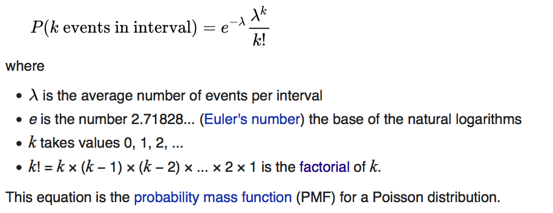
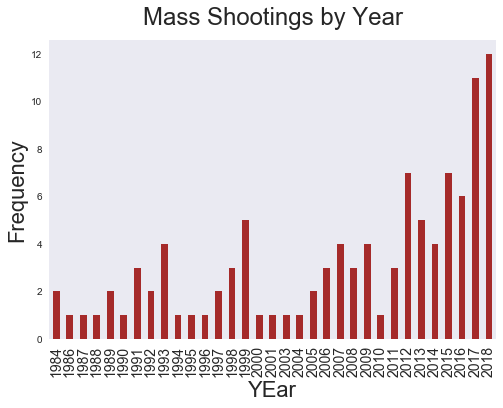
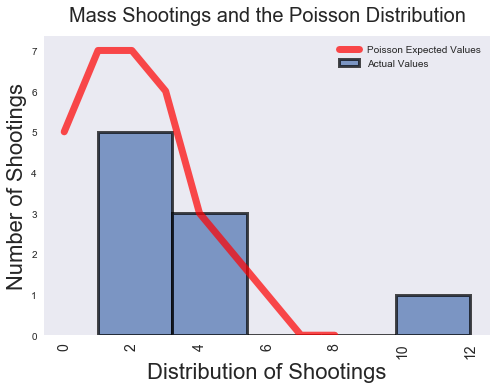

**Introduction**

Mass shootings are among the most hideous crimes. What horrifies many are the suddenness and randomness of these murders. They occur unpredictably, often in settings familiar to most: The workplace, houses of worship, nightclubs, movie theaters and schools.

This posts examines whether mass shootings follow the Poisson distribution. Poisson is a discrete probability function that provides the probability of events occurring during a specific period of time or space. Poisson presupposes that the events are independent and random.

The randomness and independence of mass shootings in any given year make these tragedies candidates for the Poisson distribution. While there is evidence that mass shootings are neither random, constant or independent, Fisher's exact test suggests that the distribution of mass shootings follows Poisson.  If so, these events are in all likelihood constant, random and independent.

**Poisson Distribution**

The Poisson distribution is a useful statistical tool because we can use it to calculate the probability of a given number of events occurring in a certain period of time. While it may be difficult to predict a mass shooting, the Poisson distribution could tell us the probability of six mass shootings occurring in a year, or even the probability of fewer than three in a year. Irrespective of the relative rarity of these events, such information could be useful to researchers and law enforcement.



***(The probability mass function for the Poisson distribution. We will use this formula below to produce the expected values for mass shootings. Source: [Wikipedia](https://en.wikipedia.org/wiki/Poisson_distribution))***


The [classic application](https://www.umass.edu/wsp/resources/poisson/) of the Poisson distribution involved deaths in the Prussian army by horse kicks. A researcher was able to show that these events followed the Poisson distribution almost perfectly. In fact, there was a 97 percent probability that there would be two or fewer annual horse kick deaths in the Prussian army. The Prussians were therefore able to assume that the horse deaths were random and independent.

It's pretty cool if you think about it: The Poisson distribution gives us the power to predict the probability of completely random, unrelated events occurring. As one scholar reflected, it gives us "a [model](https://www.umass.edu/wsp/resources/poisson/) for stuff that just happens..."

**Poisson and Mass Shootings**

There are a few ways we can prove that mass shootings follow the Poisson distribution: 1. We can visualize a Poisson distribution and compare it to a visualization of mass shootings; 2. We can conduct a Chi-Squared Goodness of Fit hypothesis test using the the expected values of a Poisson distribution compared to the actual values of mass shootings; and/or 3. We can conduct a hypothesis test using Fisher's exact test.

***Visualizing Mass Shootings***

A first step in deciding whether mass shootings follow Poisson is to visualize them. We can graph the number of mass shootings per year and then compare it to the expected values from a Poisson distribution. For this, we will use data provided by the [Mother Jones](https://www.motherjones.com/politics/2012/12/mass-shootings-mother-jones-full-data/) mass shooting database.


***(Mass shootings are rising)***

A Poisson distribution requires that data be constant, independent and random. As we see from the above visualization, mass shootings did not occur at a perfect, constant rate; if anything, they occur at an increasing rate. While the recent spikes in mass shootings are evidence against the data following Poisson, Poisson does not exclude the possibility of some variation. In fact, a perfectly ordered rate might [provide evidence](https://www.youtube.com/watch?v=sv_KXSiorFk) that the data is neither independent nor random.

Let's compare the frequency of mass shootings to the expected Poisson values. First, we need to calculate the counts for the annual frequencies of mass shootings. Next we will create the expected values using the mean number of annual mass shootings (There are on average 3 per year). We then plug this mean into the probability mass function for each frequency (there are nine in total). Last, we  plot both distributions and compare.


***Python Code***

```

import math

x =range(1,10)

poisson_counts =[]

for i in x:
    PMF = round\
    ((float((math.exp(1)**-3)*(3)**i))/float(math.factorial(i))*33,0)
    poisson_counts.append(PMF)

```
***(Python loop applying the Poisson probability mass function to create the expected values for nine mass shooting observations)***

As we can see in the visualization below, the distribution of mass shootings fits imperfectly the Poisson distribution; nevertheless, the fit is close enough for horseshoes. It could be that we don't have enough data to visualize a good fit. In the death by horse kick example above, the Prussian army had a century of data. Mother Jones has collected fewer than four decades of data. This visualization is therefore inconclusive evidence one way or the other. We will need other methods to confirm a Poisson distribution.



***(This graph compares the actual mass shooting values to those expected under a Poisson distribution)***


***Chi-Squared Goodness of Fit Test***

A few years back, a [writer](https://www.wired.com/2012/12/are-mass-shootings-really-random-events-a-look-at-the-us-numbers/) for wired.com linked the Poisson distribution to mass shootings using a Chi-Squared Goodness of Fit test. His test produced a [p-value](https://en.wikipedia.org/wiki/P-value) greater than 0.05, meaning that there was nothing statistically significant in the distribution of mass shootings compared to Poisson. They were the same statistically speaking.

The journalist cautioned that the while his p-value was not statistically significant, it was still low. He surmised that the rate of mass shootings was rising, and that this change in rate could indicate that the phenomenon is neither random nor independent. As we established above, the phenomenon has continued to rise since he wrote the article in 2012, so his observation may very well be correct.

We can conduct a similar Chi-Squared hypothesis test using updated values through 2018. The null hypothesis is that the proportions in the distributions are similar (i.e. mass shootings follow Poisson). The alternative hypothesis is that at least one category does not match (i.e. the distribution of mass shootings does not follow Poisson). We will reject the null hypothesis if we find a p-value < 0.05.

When we conduct our Chi Squared test, we get a p-value of 0.0, meaning that we reject that null hypothesis. The proportions are not the same. In other words mass shootings do not follow the Poisson distribution. The logical deduction is that these events are neither random nor independent.

There's one problem with this conclusion: The Chi Square Goodness of Fit test works best when there are more than five observations of a given expected value. In our expected Poisson distribution, we have several values that are lower than five. There's a good chance that our p-value is inaccurate.

***Fischer's Exact Test***

An alternative to the Chi-Squared test is Fisher's exact test. This is similar to Chi-Squared, except it is not sensitive to counts fewer than five. In this case, our null hypothesis is that the real and expected distributions are not different (i.e. they follow the Poisson distribution). The alternative hypothesis is that the two distributions are different (i.e. mass shootings do not follow Poisson).  When we run the test, we get a p-value of 0.64, meaning that our test result is not statistically significant. In other words, the distribution of mass shootings follows the Poisson.

 ***Implications***


There are several implications for our finding that mass shootings follow Poisson. The first is that the events must be random and independent. This makes this phenomenon even scarier. It implies that they can't be stopped, though this is not a finding of this post. Of course we can stop mass shootings. The destruction of all weapons in America would surely end mass shootings, but it's a policy that's not easily enacted. America is a nation with more firearms than people, and where the right to bear arms is constitutionally protected.

Another implication is that we can predict with a few lines of python code the probability of any number of mass shootings in a given year.

 ```
 import scipy.stats as sc

 poisson= sc.stats.distributions.poisson

 annual_mean= 3

 probability=[]

 for i in range(1,13):
     answer =  poisson.pmf(i, annual_mean)
     probability.append(answer)

print 'The probability of fewer than three mass shootings per year: {p}'.format(p = round(sum(probability[0:3]),2))

print 'The probability of two to eight mass shootings per year: {p}'.format(p = round(sum(probability[2:8]),2))

print 'The probability of having greater than five mass shootings per year: {p}'.format(p = round(sum(probability[5:]),2))

```
***(Python code producing the probability of mass shootings pursuant to the Poisson distribution)***

The results are numbing:

>The probability of at least one mass shooting per year: 0.80
>The probability of fewer than three mass shootings per year: 0.60
>The probability of two to eight mass shootings per year: 0.57
>The probability of having greater than five mass shootings per year: 0.08

While there is a low probability of greater than five mass shootings in any given year, there is a very high probability that there will be at least one mass shooting every year (0.80). Equally sobering is the high probability that there will be as few as two and as many as eight mass shootings per year (0.57).


**Conclusion**

Mass shootings follow the Poisson distribution. Nonetheless, there is reason to revisit this conclusion in the coming years. We need to remember that our Chi-Squared test found that these murders did not follow Poisson. The reason we rejected this finding was the low value of some of our expected values, which could have resulted in an inaccurate p-value.

I also have a hunch that the pattern of mass shootings has changed, and that recent elevated levels will continue or grow worse. The fact that our data does not neatly fit Poisson visually tells me that this may very well be the case. If so, the Poisson distribution will not longer describe these crimes.

We should also revaluate whether mass shootings follow Poisson in light of recent research.  [Researchers at Arizona State University](https://www.scientificamerican.com/article/mass-shootings-are-contagious/) found that mass shootings occur in clusters, and may even be contagious. Such a finding means that mass shootings are neither random nor independent, and do not approximate the Poisson distribution.

Notwithstanding the high probability that a mass shooting will occur every year, I again remind readers again that no one should draw the conclusion that we cannot stop them. Similarly, no one should draw the conclusion that there are no policy solutions to these random acts. This post only shows that mass shootings probably follow the Poisson distribution, and that this finding could be subject to revaluation.

There is a strong likelihood that these mass murders will continue. It's clear that policy makers must address the issue with a sense of immediacy. There will be at least one next year, and the solution is probably multifaceted.
