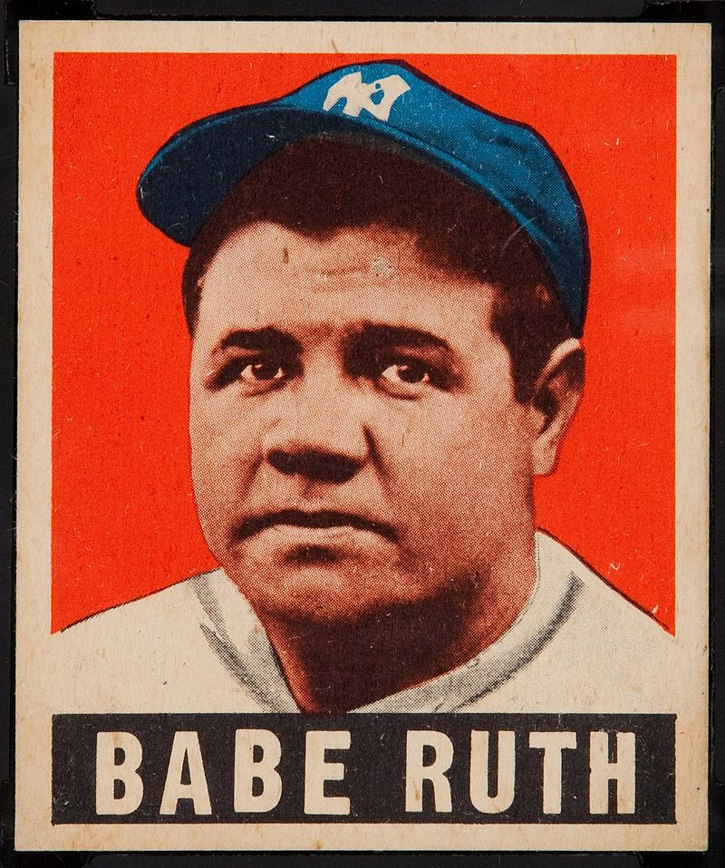
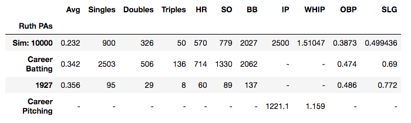
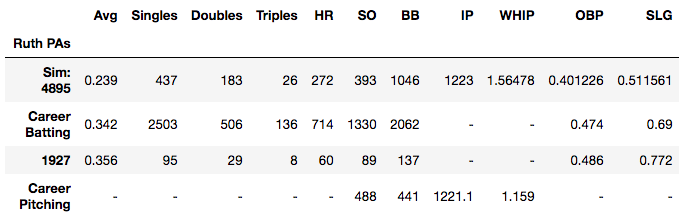
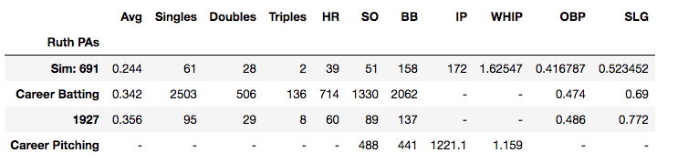
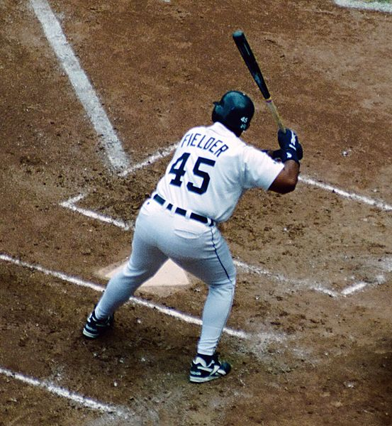

**Simulating Babe Ruth v. Babe Ruth Plate Appearances**

What would happen if Babe Ruth pitched to Babe Ruth? Thanks to statistics compiled by Stat-O-Matic, and a python based computer simulation, we can create infinite plate appearances in which the Babe pitches to himself.

This post recreates Babe Ruth's lifetime plate appearances, lifetime innings pitched, and his famous 1927 season. The result? Babe Ruth gets the best of Babe Ruth.

***Babe Ruth, Slugger & Star Pitcher***

Babe Ruth is largely considered the [greatest baseball player](https://bleacherreport.com/articles/1508392-major-league-baseball-the-case-for-babe-ruth-as-the-best-ever). The so-called Sultan of Swat was the season and career home run leader for decades, and he remains the all-time leader in the important metric of "Wins above Replacement" ([WAR](https://www.baseball-reference.com/leaders/WAR_career.shtml)).

While Ruth is largely remembered for his prodigious home run count, few recall that he was a star [pitcher](https://bleacherreport.com/articles/232338-babe-ruth-the-pitcher) for the Red Sox before Boston traded him to the New York Yankees.  Ruth had five straight seasons with an [earned run average](http://m.mlb.com/glossary/standard-stats/earned-run-average)  (ERA) below 3.00, meaning that on average, he gave up fewer than three runs per game. In 1921, Ruth led the league in ERA and shutouts (Shutouts are games in which he gave-up zero runs).



***(Babe Ruth hit 60 career home runs with the New York Yankees in 1927, a record that stood until 1961. Source: Wikimedia Commons)***

So, Ruth was a dominant pitcher and slugger. He roughed-up some of the best [batters](https://www.sportingnews.com/us/mlb/news/babe-ruth-ty-cobb-hall-of-fame-history-stats-boston-red-sox-detroit-tigers/z691p1f79qoh1bca2kyjiu86m) and pitchers throughout his career. The one player he neither pitched nor batted against was himself. This begs the question, how Babe Ruth would have performed had he pitched to himself. This query would be academic were it not for the power of the  personal computer and the detailed statistical records compiled by the good people at [Strat-O-Matic](https://www.cbsnews.com/video/50th-anniversary-of-baseballs-strat-o-matic/).

***Simulating Babe Ruth v. Babe Ruth with the Help of Strat-O-Matic***

Strat-O-Matic is a board game that allows gamers to recreate baseball games based on analyses of real players. The game prides itself on its statistical accuracy.

The company assigns outcomes on cards that correspond to various dice rolls. Columns contain 11 outcomes. Roll a four on one die, and a seven on a set of dice, and you will find one of the most common plate appearances for any given player. Roll a two or a 12, and you will find some of least common outcomes. Strat-O-Matic assigns other probabilities with the help of a 20 sided die. Roll a three, a twelve, and a twenty, and the cards will give you yet another result.

Strat-O-Matic is a fantastic analog respite in a time of digital saturation.

A few years back, Strat-O-Matic began its release of [Hall of Fame](https://www.strat-o-matic.com/product/80th-anniversary-2019-hall-of-fame-game/) edition board games. These games contain cards loaded with  statistics for all [Hall of Fame](https://baseballhall.org) (HOF) players. The card contain statistics for the most productive seven years of these HOF players. The game is so complete that it contains separate cards for Babe Ruth the pitcher and Babe Ruth the batter. These statistics make it possible to simulate infinite battles between between Ruth and Ruth.

***Coding a Babe Ruth Simulation***

The python code for this simulation is relatively simple (see below), but the outcome is powerful as it allows us to simulate any number of plate appearances. I created three random dice rolls, and assigned them to specific outcomes for Babe Ruth the pitcher and batter. I use counts to keep track of every outcome, whether it's a hit, strikeout, error, out, or [fielder's choice](https://www.baseball-reference.com/bullpen/Fielder%27s_choice). The code also keeps track of singles, doubles,triples and home runs, and calculates batting average (AVG), on base percentage (OBP) and slugging (SLG).

Notwithstanding the ubiquity of AVG, OBP & SLG, statistics such as these have varying importance. Average tells you a player's average number of hits based on his at bats. It sounds usefully, but it's incomplete as the statistic excludes many plate appearances, such as walks and sacrifice flies. OBP gives us a better idea of how often a player reaches base, but it gives little information about a player's power.  SLG gives us insight into a player's power, but like average, it too excludes many plate appearances. Nevertheless, statistics such as AVG, OBP & SLG are useful for purposes of the simulation as they allow us to compare performance with the metrics of Babe Ruth's actual career.

***Limitations***

There are limitations to the simulation: The code only simulates plate appearances; it does not simulate entire games. For this reason, the program excludes runs batted in (RBI), ERA and sacrifice flies. There are no stolen bases, no hit and run situations, and no bunts. To keep the simulation relatively simple, it utilizes the lifetime outcomes for Babe Ruth rather than his outcome versus left handers (Babe Ruth was a lefty). The so-called Bambino had normal power against lefties, so it may have made little difference.


I also had to assign the fielding prowess of every player other than Ruth. In fairness, I matched the entire team's fielding ability to Ruth's. Ruth was fair in the field. He was neither great nor bad. In fairness, I assigned a similar rating to the entire team hoping that it would average out the effects of good and bad fielders.

To be thorough, I ran three different Babe Ruth simulations. First, I simulated the number of career plate appearances (10,623) to see how Ruth's career batting numbers would fare against himself. Next, I simulated the number of career innings pitched (1221.1) so as to compare with his career pitching statistics. I also simulated the number of plate appearances for Ruth's record-setting 1927 season, where he batted .356 and hit 60 home runs.

Finally, I adjusted the simulation for those instances where Strat-O-Matic called for players to re-roll the 20 sided dice again and again. While the simulation does re-roll the dice in some instances, I wanted to avoid the rarity of multiple re-rolls. When the simulation resulted in another re-roll, I assign probabilities rather than roll a third time.

***Simulating Every Babe Ruth Plate Appearance***

In the first simulation, neither Babe Ruth the batter nor Babe Ruth the pitcher perform at Ruthian levels. At .232, Babe's batting average is considerably lower than his career .342. His slugging and on base percentage is much lower too.

Ruth did hit an elite level 570 home runs in the career simulation, making him a career home run record leader, though [Willy Mays](https://www.baseball-reference.com/players/event_hr.fcgi?t=b&id=mayswi01) would have surpassed this record in 1968. [Hank Aaron](https://www.baseball-reference.com/players/event_hr.fcgi?t=b&id=aaronha01), [Frank Robinson](https://www.baseball-reference.com/players/event_hr.fcgi?t=b&id=robinfr02) and [Harmon Killebrew](https://www.baseball-reference.com/players/event_hr.fcgi?t=b&id=killeha01) would have similarly surpassed 570 home runs in 1970, 1974 and 1975 respectively.

Puzzling however are the number of strikeouts in the full career batting simulation. Babe Ruth was as gifted at striking out as he was at hitting home runs. In this simulation, Babe Ruth struck out 500 fewer times, and was able to put the ball in play more often when batting against himself.



***(With a .232 batting average, Babe Ruth had difficulty obtaining hits in the 10,623 plate appearance simulation)***

***Simulating Babe Ruth's Lifetime Innings Pitched***

Babe Ruth's career pitching simulation shows some decay in performance.+  Though he keeps Babe Ruth the batter below .240 -- no easy task -- we see an explosion in the number of walks, in addition to a decline in the number of strikeouts.

Ruth had an even strikeout to walk ratio (1.1) throughout his career. Not bad, but not great by all-time pitching standards. In the simulation, this ratio declines to .376. Not good by any standard. In fact, Babe walked the Babe over 1,000 times (21%) during the simulation. Babe's WHIP (Wins Plus Hits over Innings Pitched) was less impressive in the simulation than in real life.



***(Babe Ruth's strikeout to walk ratio collapses in the 1,221.1 innings pitched simulation)***

***Simulating Ruth's 1927 Season***

The simulation of Babe Ruth's fabled 1927 season gives us tremendous insight into Babe Ruth's prowess as a slugger and an ace. He deserves credit at the plate: He hit 39 home runs in the 1927 simulation. This gives him the [third most](http://www.espn.com/mlb/history/season/_/year/1927) home runs in 1927 next to [Lou Gehrig](https://mistercoffey.github.io/OpinionMining/) and himself. Ruth also struck out less, hit more triples, and walked more.



*(The 1927 simulation reveals that Babe Ruth would still hit close to 40 home runs against himself, though his AVG still suffered)*

We should also commend Babe Ruth the pitcher for his 1927 simulation. He prevented Babe Ruth the batter from breaking the home run record. Though Babe Ruth the pitcher had a higher WHIP when compared to his lifetime number, he stopped Ruth from batting over .250. Indeed, Ruth resembles players like [Cecil Fielder](https://www.baseball-reference.com/players/f/fieldce01.shtml) or [Jesse Barfield](https://www.baseball-reference.com/players/b/barfije01.shtml) more than himself. I always enjoyed watching both Fielder & Barfield play, so I say this with the highest admiration for both.



***(Babe Ruth plays like Cecil Fielder in the 1927 simulation. It's a commendable performance, but the real Babe Ruth played much better. Source: Wikimedia Commons)***  

In conclusion, Babe Ruth was probably the only player capable of humanizing Babe Ruth. The simulation reveals that both would have performed admirably in terms of career and single season statistics. Still, neither performance guaranteed the Bambino the highest seat in the baseball pantheon. Babe Ruth should be grateful that he never faced himself on a regular basis.


+Note that there is a discrepancy between the innings pitched (IP) in this simulation. This is because I estimated the number of IPs based on the average number of batters faced per inning during Ruth's lifetime.

***Python Code***

```
def babe_ruth(plate_appearances):

    import random
    import numpy as np
    import pandas as pd

    x = 0 #Simulation count

    #Outcome count
    out = 0
    walks = 0
    hits = 0
    SO = 0
    FC = 0
    error = 0
    single = 0
    double = 0
    triple = 0
    homerun = 0

    # Die roll for column

    def die_column():
        roll = random.randint(1,6)
        return roll

    # Two Dice roll for outcome

    def die_outcome():
        roll = random.randint(2,12)
        return roll

    # 20 sided dice roll for splits

    def die_splits():
        roll = random.randint(1,20)
        return roll

    #Number of simulations

    while x < plate_appearances:


        # Rolling Dice
        column = die_column()
        outcome = die_outcome()
        splits = die_splits()


    #Babe Ruth Batting Stats from Strat-o-Matic

        if column == 1:
            if outcome == 2:
                walks +=1
            if outcome == 3:
                walks +=1
            if outcome == 4:
                homerun += 1
                hits += 1
            if outcome == 5:
                homerun += 1
                hits += 1  
            if outcome == 6:
                homerun += 1
                hits += 1
            if outcome == 7:
                if splits <15:
                    homerun += 1
                    hits += 1
                if splits > 14:
                    double +=1
                    hits +=1
            if outcome == 8:
                if splits <7:
                    triple += 1
                    hits += 1
                if splits > 6:
                    double +=1
                    hits +=1       
            if outcome == 9:
                out +=1
            if outcome == 10:
                if splits <15:
                    double += 1
                    hits += 1
                if splits > 14:
                    single +=1
                    hits +=1               
            if outcome == 11:
                single +=1
                hits +=1                
            if outcome == 12:
                out +=1

        if column == 2:
            if outcome == 2:
                out +=1
            if outcome == 3:
                out +=1
            if outcome == 4:
                out += 1
            if outcome == 5:
                out += 1
                SO += 1  
            if outcome == 6:
                out += 1
                SO += 1
            if outcome == 7:
                out += 1
            if outcome == 8:
                out += 1
                SO += 1      
            if outcome == 9:
                out += 1
                SO += 1
            if outcome == 10:
                walks +=1              
            if outcome == 11:
                walks +=1            
            if outcome == 12:
                walks +=1      

        if column == 3:

            if outcome == 2:
                walks +=1
            if outcome == 3:
                walks +=1
            if outcome == 4:
                walks +=1
            if outcome == 5:
                single += 1
                hits += 1  
            if outcome == 6:
                single += 1
                hits += 1  
            if outcome == 7:
                walks +=1
            if outcome == 8:
                walks +=1  
            if outcome == 9:
                walks +=1
            if outcome == 10:
                walks +=1              
            if outcome == 11:
                if splits <7:
                    single += 1
                    hits += 1
                if splits > 6:
                    out += 1
            if outcome == 12:
                out +=1      

    #Babe Ruth Pitching Statistics from Strat-o-Matic

        if column == 4:

            if outcome == 2:
                out +=1
            if outcome == 3:
                if splits <3:
                    single += 1
                    hits += 1
                if splits >2 and splits < 10:
                    out +=1
                if splits > 9 and splits <14:
                    FC += 1
                if splits > 13 and splits <19:
                    out +=1
                if splits == 19 or splits == 20:
                    new_result = die_splits()
                    if new_result <3:
                        single += 1
                        hits += 1
                    if new_result >2 and new_result < 10:
                        out +=1
                    if new_result > 9 and new_result <14:
                        FC += 1
                    if new_result > 13 and new_result <19:
                        out +=1
                    if splits == 20:
                        out +=1                
            if outcome == 4:
                out += 1
            if outcome == 5:
                if splits <2:
                    homerun += 1
                    hits += 1  
                if splits >1:
                    out +=1
            if outcome == 6:
                if splits <11:
                    double += 1
                    hits += 1
                if splits > 10:
                    single +=1
                    hits +=1
            if outcome == 7:
                if splits <17:
                    single += 1
                    hits += 1
                if splits > 16:
                    out +=1
            if outcome == 8:
                walks +=1  
            if outcome == 9:
                walks +=1
            if outcome == 10:
                if splits <3:
                    single += 1
                    hits += 1
                if splits > 2 and splits <=9:
                    out +=1
                if splits >= 10 and splits <= 19:
                    error +=1
                if splits == 20:
                    out +=1   
            if outcome == 11:
                if splits <3:
                    out += 1                
                if splits == 3:
                    error +=1
                if splits >3 and splits < 9:
                    out +=1
                if splits == 9:
                    double +=1
                    hits +=1
                if splits == 10:
                    out += 1
                if splits == 11:
                    single +=1
                    hits +=1
                if splits >11 and splits < 15:
                    out+=1
                if splits == 15:
                    single +=1
                    hits +=1   
                if splits >15:
                    out +=1                        
            if outcome == 12:
                out +=1
                SO +=1                     

        if column == 5:

            if outcome == 2:
                out +=1
            if outcome == 3:
                if splits <3:
                    out += 1                
                if splits == 3:
                    error +=1
                if splits >3 and splits < 9:
                    out +=1
                if splits == 9:
                    double +=1
                    hits +=1
                if splits == 10:
                    out += 1
                if splits == 11:
                    single +=1
                    hits +=1
                if splits >11 and splits < 15:
                    out+=1
                if splits == 15:
                    single +=1
                    hits +=1   
                if splits >15:
                    out +=1

            if outcome == 4:

                if splits <3:
                    single += 1
                    hits += 1
                if splits >2 and splits < 10:
                    out +=1
                if splits > 9 and splits <14:
                    FC += 1
                if splits > 13 and splits <19:
                    out +=1
                if splits == 19:  
                    new_result = die_splits()
                    if new_result <3:
                        single += 1
                        hits += 1
                    if new_result >2 and new_result < 10:
                        out +=1
                    if new_result > 9 and new_result <14:
                        FC += 1
                    if new_result > 14:
                        out +=1
                if splits == 20:
                    new_result = die_splits()
                    if new_result <3:
                        single += 1
                        hits += 1
                    if new_result >2 and new_result < 10:
                        out +=1
                    if new_result > 9 and new_result <14:
                        FC += 1
                    if new_result > 14:
                        out +=1                    
            if outcome == 5:
                if splits <3:
                    single += 1
                    hits += 1
                if splits > 2 and splits <9:
                    out +=1
                if splits > 9 and splits <19:
                    error +=1
                if splits == 19:
                    error += 1
                if splits == 20:
                    out +=1                 
            if outcome == 6:
                out += 1
            if outcome == 7:
                out += 1
            if outcome == 8:
                out += 1      
            if outcome == 9:
                out += 1
            if outcome == 10:
                out += 1            
            if outcome == 11:
                out += 1        
            if outcome == 12:
                out += 1    

        if column == 6:

            if outcome == 2:
                out +=1
            if outcome == 3:
                out +=1
            if outcome == 4:
                if splits <8:
                    out+=1
                if splits == 8:
                    single += 1
                    hits += 1
                if splits > 8 and splits <17:
                    out += 1
                if splits > 13 and splits <17:
                    out +=1
                if splits == 17:  
                    new_result = die_splits()
                    if new_result <2:
                        single += 1
                        hits += 1
                    if new_result >1:
                        out+=1
                if splits == 18:  
                    new_result = die_splits()
                    if new_result <2:
                        single += 1
                        hits += 1
                    if new_result >1:
                        out+=1
                if splits == 19:  
                    new_result = die_splits()
                    if new_result <2:
                        single += 1
                        hits += 1
                    if new_result >1:
                        out+=1
                if splits == 20:  
                    new_result = die_splits()
                    if new_result <2:
                        single += 1
                        hits += 1
                    if new_result >1:
                        out+=1                          
            if outcome == 5:
                if splits <3:
                    single += 1
                    hits += 1
                if splits > 2 and splits <=9:
                    out +=1
                if splits >= 10 and splits <= 19:
                    error +=1
                if splits == 20:
                    out +=1                
            if outcome == 6:
                out += 1
            if outcome == 7:
                out += 1
            if outcome == 8:
                out += 1      
            if outcome == 9:
                out += 1
            if outcome == 10:
                out += 1            
            if outcome == 11:
                out += 1        
            if outcome == 12:
                out += 1                
        x+=1

    #Creating Relevant Statistics

    stats = [round(float(hits)/(float(x)-float(walks)),3), int(single),\
         int(double), int(triple),int(homerun),int(SO),int(walks), x/4,\
         float((walks+hits)/float(x/3.9)),\
             (float(hits)+float(walks))/float(x),\
             (float(single)+float(double*2)+float(triple*3)+float(homerun*4))/\
             (float(x)-float(walks))]

    stats_batting = [.342,2503,506,136,714,1330,2062,'-','-',.474,.690]
    stats_pitching = ['-','-','-','-',\
                      '-','488','441',1221.1,1.159,'-','-']
    stats_1927 = [.356,95,29,8,60,89,137,'-','-',.486,.772]
    #Creating dataframe & populating with stats

    df = pd.DataFrame(stats).T

    #Creating Column Names
    df.index.name = 'Ruth PAs'
    df.loc[1] =stats_batting
    df.loc[2] =stats_1927
    df.loc[3] =stats_pitching

    df.rename(index = {0:'Sim: '+""+ str(plate_appearances),
                       1:"Career Batting",
                       2:'1927',
                       3:'Career Pitching'
                       },\
              columns={0:'Avg',\
                       1:'Singles', \
                       2:'Doubles',\
                       3:'Triples',
                       4:'HR',
                       5:'SO',
                       6:'BB',
                       7:'IP',
                       8:'WHIP',
                       9:'OBP',
                      10:'SLG'},inplace=True)
    return df

```
